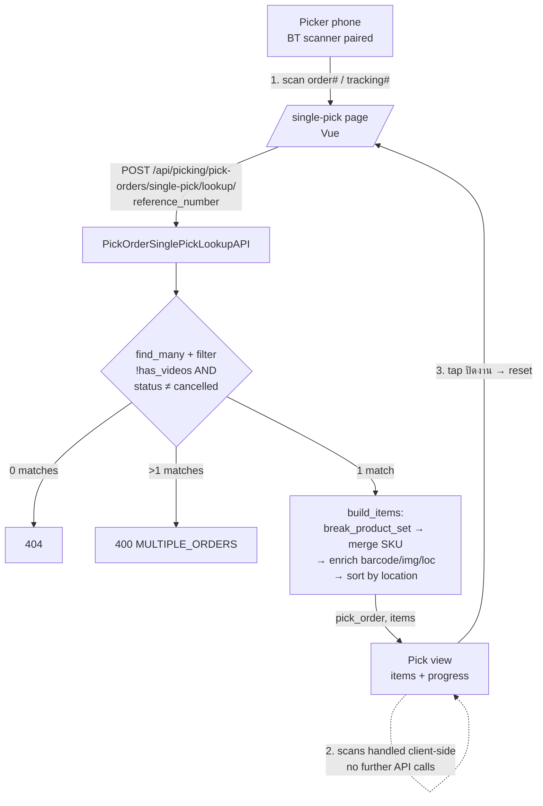
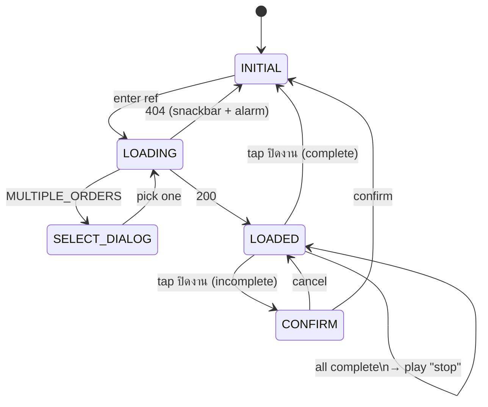

# Single Pick — Getting Started

Mobile barcode-scan verification for one order at a time. Frontend-only — no DB writes. Runs alongside the existing pick → pack → video flow.

> Detail lives in the running app + source. This doc is the map.

---

## Where things are

| Layer | File | Role |
|---|---|---|
| backend | [picking/views/pick_order.py](../../../../../dobybot/picking/views/pick_order.py) | `PickOrderSinglePickLookupAPI` + `build_items` |
| backend | [picking/urls.py](../../../../../dobybot/picking/urls.py) | Route registration |
| backend | [picking/tests/test_views_pick_order.py](../../../../../dobybot/picking/tests/test_views_pick_order.py) | `PickOrderSinglePickLookupTestCase` (12 tests) |
| frontend | [pages/single-pick/index.vue](../../../../../dobybot-ui/pages/single-pick/index.vue) | The page (single-file Vue component) |
| frontend | [components/layout/AppDrawer.vue](../../../../../dobybot-ui/components/layout/AppDrawer.vue) | Drawer entry |
| frontend | [utils/sound.ts](../../../../../dobybot-ui/utils/sound.ts) | `require.context` recursive — resolves `cheerup/ding` |
| i18n | [lang/translation/en.json](../../../../../dobybot-ui/lang/translation/en.json) · [th](../../../../../dobybot-ui/lang/translation/th.json) · [zh-Hans](../../../../../dobybot-ui/lang/translation/zh-Hans.json) · [zh-Hant](../../../../../dobybot-ui/lang/translation/zh-Hant.json) | `single-pick.*` + `drawer.single-pick` |

No new models · no migrations · no new audio assets · no new dialogs (reuses [`SelectOrderNumberDialog`](../../../../../dobybot-ui/components/dialogs/SelectOrderNumberDialog.vue)).

---

## Request flow



---

## Frontend state machine



---

## Sound + vibration

| Event | Sound | Vibrate |
|---|---|---|
| Correct scan / line complete | `cheerup/ding` | — |
| Wrong scan / over-scan | `alarm` | `[100,50,100,50,100]` |
| Order complete | `stop` | — |

---

## Load-bearing decisions (don't change without re-grilling)

| # | Rule | Why |
|---|---|---|
| 1 | Separate from `/bulk-pick` — no shared code | Different optimization (verify-one vs combine-many) |
| 2 | No DB writes | Pure UX tool; logging is a future feature |
| 3 | Eligibility = `!has_videos AND status≠cancelled`. **Not** `has_fixcases`, **not** `ready_to_ship` | Fixcases are address/customer issues, unrelated to picking |
| 4 | qty>1 → scan every unit | Forcing function; one-scan-trust-N defeats the point |
| 5 | ProductSet expanded, same SKU merged | Picker grabs N from one bin regardless of bundle origin |
| 6 | No barcode → still pickable via SKU scan or "Manual confirm" button | Single missing barcode shouldn't disable the whole order |
| 7 | Match scope = current order only (barcode field, then SKU) | Avoids global Product ambiguity |
| 8 | Hardware BT scanner only — no camera | User rejected camera explicitly |
| 9 | Wrong/over-scan = alarm + vibrate. No undo button | Undo gives picker a way to lie to the system |
| 10 | URL `?ref=` persists across refresh; scan progress does NOT | Shared phones — no cross-picker leakage |
| 11 | Sort by `Product.location` asc, no-location at bottom | Minimizes walking |
| 12 | Permission = `view_pickorder` (same as bulk-pick) | Reuse existing role |

Full rationale was captured during design grilling — see git history of this file or ask the user.

---

## API contract (cheat sheet)

```
POST /api/picking/pick-orders/single-pick/lookup/
     { reference_number: "ABC123" }

200  { pick_order: {...}, items: [{sku,name,number,barcode,image,location}, ...] }
400  { code: "MULTIPLE_ORDERS", pick_orders: [...] }
400  { code: "NO_ITEMS", detail: "..." }
400  { reference_number: ["..."] }   ← blank/whitespace
404  no match OR all matches filtered out
```

`reference_number` resolves via `PickOrder.find_many()`: order# → order_trackingno → `picking.TrackingNo`.

---

## Run / test

```bash
# backend
cd dobybot && source .venv/bin/activate
python manage.py test picking.tests.test_views_pick_order.PickOrderSinglePickLookupTestCase --tag=single-pick -v 2
# 12 tests. Other failures in this file pre-exist on main (hard-coded order numbers).

# frontend
cd dobybot-ui
npx eslint pages/single-pick/index.vue components/layout/AppDrawer.vue utils/sound.ts
npx tsc --noEmit | grep -v node_modules
npm run dev   # then visit /single-pick as a user with view_pickorder
```

QA checklist: see [../QA/](../QA/).

---

## Extension seams (for future work)

| Hook | Add what here |
|---|---|
| `applyLookupResponse(response)` | "order just loaded" — e.g. start-time log |
| `incrementItem(item)` | "successful scan happened" |
| `closeOrder()` | "picker is done" — e.g. POST log endpoint |

Known deferred: pick logging (audit trail), reason capture on partial close, mute toggle, multi-user collision warning.
