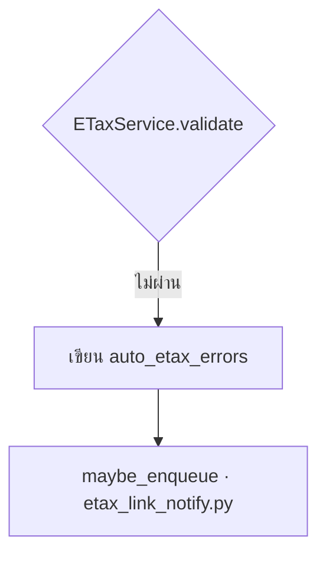

# Diagram — subset ของ mermaid ที่เขียนได้

ไดอะแกรมใน learn-diff v3 เขียนเป็น **mermaid** ใน code fence แล้ว viewer จัด layout ให้เอง
agent ไม่ต้องวาง node เอง ไม่ต้องเขียน HTML/CSS และ**ห้ามกำหนดสีเอง**

````markdown

````

`title="…"` ใส่หรือไม่ใส่ก็ได้ — ถ้าใส่จะกลายเป็นคำบรรยายบนหัวกรอบ

## กฎเหล็ก: เขียนได้เฉพาะ subset นี้

**ทั้งหมดที่เขียนได้มีเท่านี้** อย่างอื่นของ mermaid ถือว่าผิดกฎ ไม่ใช่ "ไม่แนะนำ"

| เขียนได้ | ตัวอย่าง |
|---|---|
| หัวไดอะแกรม (บรรทัดแรกเท่านั้น) | `flowchart TB` · ทิศทาง: `TB` `TD` `LR` `RL` `BT` |
| node | `A[สี่เหลี่ยม]` · `A(มุมมน)` · `A([แคปซูล])` · `A{คำถาม/เงื่อนไข}` |
| เส้นเชื่อม | `A --> B` · `A --- B` · `A -.-> B` · `A -.- B` |
| เส้นเชื่อมมีป้าย | `A -- ผ่าน --> B` · `A -->\|ไม่ผ่าน\| B` · `A -. ข้ามไป .-> B` |
| กลุ่ม | `subgraph NEW [ชื่อกลุ่ม]` … `end` · ใส่ `direction TB` ข้างในได้ |
| ทาสี | `class A,B changed` (ดูหัวข้อถัดไป) |
| ประกาศสีเอง (เลี่ยงถ้าไม่จำเป็น) | `classDef ชื่อ fill:#…,stroke:#…` |
| คอมเมนต์ | `%% ข้อความ` |

`subgraph` **ต้องมี id** (`subgraph NEW [ชื่อ]`) เพราะ `class` อ้างจาก id — ทาสีทั้งกลุ่มได้ด้วย
`class NEW changed`

### ห้าม และให้ใช้อะไรแทน

| ห้าม | ใช้แทน |
|---|---|
| `click A "…"` | ไม่ต้องทำอะไร — การกด node มาจาก `nodeMap` ใน run.json |
| `style A fill:#f00` / `linkStyle` | `class A changed` |
| `A:::changed` (ติดกับ node) | บรรทัด `class A changed` แยกต่างหาก |
| `%%{init: …}%%` / front matter `---` | ธีมทั้งหมดตั้งที่ viewer |
| `A ==> B`, `A o--o B`, `A ----> B` | `A --> B` |
| `A --> B & C` | เขียนแยกทีละเส้น |
| `A{{…}}` `A[[…]]` `A[(…)]` `A((…))` `A>…]` | 4 รูปทรงในตารางข้างบน |
| `sequenceDiagram` / `gantt` / `classDiagram` / ฯลฯ | `flowchart` เท่านั้น |

**ทำไมถึงเข้มขนาดนี้:** contract ที่เสถียรของ v3 คือ "ข้อความ mermaid" ไม่ใช่ JSON ที่เราคิดเอง
(โมเดลเขียน mermaid ถูกอยู่แล้ว ส่วน schema ที่เราประดิษฐ์ขึ้นมันไม่เคยเห็น) แลกกับข้อดีนั้น
เราต้องคุมภาษาที่ใช้จริงให้เล็กพอที่วันหนึ่งจะเขียน parser ของตัวเองมารองรับได้
ถ้าปล่อยให้ใช้ทั้งภาษา engine จะเปลี่ยนไม่ได้จริง ต่อให้โค้ดฝั่ง viewer แยก module ไว้แล้วก็ตาม
(ดู SPEC-v3 → Diagrams)

## สีบอกความหมาย — มี 3 class ให้ใช้

viewer ประกาศ `classDef` ให้อัตโนมัติแล้ว **เรียกใช้ได้เลย ไม่ต้องประกาศเอง**

| class | ความหมาย | หน้าตา |
|---|---|---|
| `changed` | จุดที่ PR นี้เพิ่ม/แก้ | พื้นเหลือง ขอบส้มหนา |
| `risk` | จุดเสี่ยง / สิ่งที่ขอแล้วยังไม่ได้ทำ | พื้นแดงอ่อน |
| `external` | ระบบภายนอก repo (Lazada, Taximail, …) | เส้นประ สีจาง |
| *(ไม่ใส่ class)* | ของเดิมที่ PR นี้ไม่แตะ | ขาว-เทา ปกติ |

viewer ขึ้นคำอธิบายสีใต้ไดอะแกรมให้เอง ตาม class ที่ใช้จริง — ไม่ต้องเขียน legend ในไดอะแกรม
และเพราะสีมาจาก viewer โหมดมืดจึงถูกต้องอัตโนมัติ · ถ้าเขียน `classDef changed …` เอง
ของที่เขียนจะชนะ (แต่จะได้สีที่เพี้ยนในโหมดมืด — อย่าทำ)

**กฎการใช้:** ไดอะแกรมของ learn-diff ต้องตอบคำถาม "ของใหม่อยู่ตรงไหนของของเดิม" ได้ในแวบเดียว
วาดของเดิมรอบ ๆ ด้วยเสมอ แล้วทา `changed` เฉพาะจุดที่ PR แตะ · ไดอะแกรมที่ทุกกล่องเป็น `changed`
แปลว่าตัดบริบทออกมากเกินไป

## ให้กด node แล้วเปิดโค้ดได้

`nodeMap` ใน `run.json` map **node id → reading list id**

```json
{ "nodeMap": { "ENQ": "rl-trigger", "HANDLER": "rl-handler" } }
```

node ที่มีในแผนที่นี้จะถูกทำเครื่องหมาย (ขีดเส้นใต้แบบจุด) ว่า "มีโค้ดให้อ่านต่อ" **และกดได้จริง** —
กดแล้ว panel ด้านขวาเปิดลำดับการอ่านของ node นั้น (ไม่ได้ใช้คำสั่ง `click` ของ mermaid
viewer เดินบน SVG แล้วผูก handler เองจาก `nodeMap`)

ข้อบังคับสองข้อ ซึ่ง server ตรวจให้ทุกครั้งที่โหลด run แล้วขึ้นเป็น warning บนหัวหน้า:

- **key ต้องเป็น node id ที่มีอยู่จริงในไดอะแกรมสักอันของ run นี้** (สะกดผิด = `diagram_node_not_found`)
  · ชี้ที่ id ของ `subgraph` ไม่ได้ — กรอบของ subgraph กดไม่ได้ ให้ชี้ node ข้างในแทน
- **value ต้องเป็น id ของ reading list ที่มีนิยามใน `readingLists`** (= `reading_list_not_found`)

## เขียนยังไงให้อ่านรู้เรื่อง

- **ใช้ `TB` เป็นค่าเริ่มต้น** คอลัมน์เนื้อหากว้างประมาณ 700px · `LR` ที่ยาวเกิน ~4 กล่อง
  จะล้นออกนอกจอแล้วต้องเลื่อนซ้าย-ขวา (viewer ไม่ย่อไดอะแกรมให้พอดีจอ เพราะย่อแล้วอ่านตัวหนังสือไม่ออก)
  `LR` เหมาะกับโซ่สั้น ๆ 2–4 กล่องเท่านั้น
- **ป้ายในกล่องต้องอ่านรู้เรื่องโดยไม่ต้องเปิดโค้ด** — `[maybe_enqueue · etax_link_notify.py]`
  ดีกว่า `[enqueue]` · ใส่ชื่อไฟล์ต่อท้ายด้วย ` · ` เมื่อกล่องนั้นคือโค้ดจริง
- **ความสูงของ `TB` โตตามจำนวน "ชั้น" ไม่ใช่จำนวนกล่อง** — ไดอะแกรมภาพรวมบนหน้า index
  ไม่ควรเกิน **~8–10 ชั้นแนวตั้ง** (ประมาณหนึ่งถึงสองจอที่คอลัมน์ 700px) · 19 กล่องที่เรียงต่อกัน
  เป็นโซ่เดียว ~15 ชั้นสูงกว่า 2,000px แม้จำนวนกล่องจะ "ไม่เยอะ"
- **ระบบใหญ่เกินเพดานชั้น = แบ่งระดับ ไม่ใช่ยัดทุกอย่างลงรูปแรก** — หน้า index วาดภาพหยาบ
  ระดับ subsystem (กล่องละหนึ่งก้อนใหญ่ แต่ละกล่อง map ไปหา section ผ่าน boxMap/nodeMap)
  แล้วเอารายละเอียดไปวาดเป็นไดอะแกรมย่อยในหน้า section ของมันเอง อย่าซ้ำรายละเอียดทั้งหมด
  ไว้ในรูปแรก
- **หนึ่งไดอะแกรมตอบหนึ่งคำถาม** และเพดานรอง: เกิน ~20 กล่องต่อรูปแปลว่าควรแยกเป็นสองรูป
- ใช้ `subgraph` เมื่ออยากบอกว่า "ทั้งกระจุกนี้คือของใหม่" หรือ "ทั้งกระจุกนี้อยู่คนละ service"
- ป้ายบนเส้นใช้กับกิ่งที่มีเงื่อนไข (`ผ่าน` / `ไม่ผ่าน`) เท่านั้น อย่าใส่ทุกเส้น
- เส้นประ (`-.->`, `-.-`) ใช้สื่อ "ความสัมพันธ์ที่ไม่ใช่การไหลของข้อมูล" เช่น หมายเหตุประกอบ

## ถ้าเขียนหลุด subset จะเป็นยังไง

- **หลุดกฎ** — ไดอะแกรมยังวาดออกมา แต่มีแถบแดงคาดหัวรูปให้ผู้อ่านเห็น พร้อมเลขบรรทัดและวิธีแก้
  (ตั้งใจให้ดัง ผู้อ่านจะได้ทักกลับมา)
- **mermaid อ่านไม่ออกเลย** — ขึ้นกล่องแดงพร้อม error จริงและ source เต็ม ๆ ไม่ใช่รูปพังหรือหน้าขาว

กฎทั้งหมดในหน้านี้บังคับด้วยโค้ดที่ `viewer/src/lib/diagram/subset.ts` (เทสต์:
`viewer/test/diagram.test.ts`) — แก้กฎที่นั่นแล้วต้องแก้หน้านี้ด้วยเสมอ
