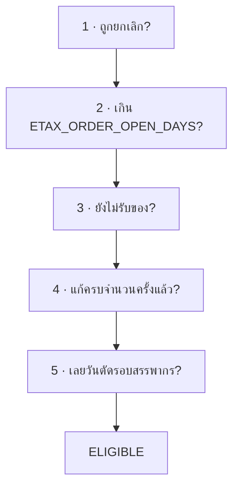

## ทำไมต้องมีไฟล์นี้

เงื่อนไข “ผู้ซื้อเปิดหน้า ETax Link ของออเดอร์นี้ได้หรือยัง” เดิมเขียนกระจายอยู่ใน `GetLastestTaxDocumentAPIView` ซึ่งเป็น endpoint ที่หน้า public เรียก ตอนนี้มี**ผู้ใช้รายที่สอง**: ก่อนจะ*ส่ง*ลิงก์ออกไปหาผู้ซื้อ ระบบต้องถามคำถามเดียวกันนี้ก่อน มิฉะนั้นเราจะส่งลิงก์ที่กดแล้วขึ้น error ไปให้คน — ซึ่งแย่กว่าไม่ส่งเลย

**ทางเลือกที่ไม่ได้เลือก:** copy เงื่อนไขไปเขียนซ้ำในตัวส่ง — เร็วกว่า ไม่ต้องแตะ view เดิม และไม่มีความเสี่ยงเรื่อง regression ของ endpoint สาธารณะเลย **แต่**วันที่ใครสักคนแก้เงื่อนไขที่หนึ่ง แล้วลืมอีกที่ ระบบจะเริ่มส่งลิงก์ตายออกไปโดยไม่มีใครรู้ และอาการจะปรากฏที่ผู้ซื้อ ไม่ใช่ที่ log จึงยอมจ่ายค่าความเสี่ยงตอนนี้ แลกกับการมีที่เดียวตลอดไป

เริ่มอ่านโค้ดจริงได้ที่ :read[ลำดับการอ่านของด่าน eligibility]{list="rl-eligibility"} — 4 ช่วง เรียงจาก “ฟังก์ชันนี้ตอบอะไรได้บ้าง” ไปหา “ตัวด่านจริง” และปิดท้ายด้วยด่านเดิมใน :file[etax_service.py]{path="services/dobybot/services/etax_invoice/etax_service.py" lines="440-470"} ที่ PR นี้ไม่ได้แตะ แต่ต้องอ่านถึงจะเข้าใจว่ากำลังทำให้อะไรสอดคล้องกัน

## โครงของ helper

จุดที่ทำให้มันไม่ใช่แค่ฟังก์ชัน boolean: **ตอบว่าไม่ผ่าน*เพราะด่านไหน*** เหตุผลคือรหัส error ที่ส่งกลับหน้าเว็บ**ซ้ำกันได้** — ทั้งด่าน “เกินจำนวนวัน” และด่าน “เลยวันตัดรอบของออเดอร์” ต่างส่ง `ORDER_IS_NO_LONGER_ELIGIBLE_FOR_ETAX_REQUEST` เหมือนกัน แต่คนละสาเหตุ ถ้าตอบเป็น error code ตรง ๆ ตัวส่งจะแยกไม่ออกว่าควรลองใหม่รอบหน้า (ยังไม่รับของ → เดี๋ยวก็รับ) หรือไม่มีวันผ่านแล้ว (เกิน 10 วัน → จบ)

```python title="services/dobybot/etax/utils/etax_link_eligibility.py" lines="61–79"
@dataclass(frozen=True)
class ETaxLinkEligibility:
    """ผลการตรวจ — `reason=None` คือเปิดให้ขอได้"""

    reason: Optional[ETaxLinkBlockReason] = None

    @property
    def is_allowed(self) -> bool:
        return self.reason is None

    @property
    def error_code(self) -> Optional[str]:
        """รหัส error สำหรับส่งกลับหน้าเว็บ (None ถ้าผ่าน)"""
        if self.reason is None:
            return None
        return ERROR_CODE_BY_REASON[self.reason]

ELIGIBLE = ETaxLinkEligibility()
```

**reason → error code เป็นการ map ทางเดียว** (many-to-one) — เจตนาคือ “ภาษาภายใน” กับ “ภาษาที่ส่งออกหน้าเว็บ” แยกกัน แก้ข้อความหน้าเว็บได้โดยไม่กระทบตรรกะ และเพิ่มด่านใหม่ได้โดยไม่ต้องคิดค้น error code ใหม่

## ลำดับของด่าน — และทำไมลำดับถึงสำคัญ

ทุกด่าน `return` ทันทีที่ไม่ผ่าน แปลว่า**ด่านที่อยู่ก่อนเป็นตัวที่พูดก่อนเสมอ** ผู้ซื้อจึงเห็นเหตุผลที่ “ต้นทางที่สุด” ก่อน — ออเดอร์ที่ถูกยกเลิก*และ*เกิน 10 วัน ควรบอกว่า “ออเดอร์ถูกยกเลิก” ไม่ใช่ “หมดเวลาขอ” เพราะข้อแรกอธิบายสถานการณ์ได้จริง



## 🚨 จุดที่เปลี่ยนพฤติกรรม ทั้งที่ตั๋วบอกว่าจะไม่เปลี่ยน

#219 เขียนไว้ตรงตัวว่า *“พฤติกรรมที่ผู้ใช้เห็นต้องไม่เปลี่ยนแม้แต่นิดเดียว”* และมี AC ว่า *“รหัส error ที่หน้า public ส่งกลับไปเหมือนเดิมทุกกรณี … รวมกรณีเลย cutoff”* เทียบสองฝั่งแล้ว มีจุดที่ไม่เป็นตามนั้น

```python title="โค้ดเดิมใน views.py (ถูกลบออกไป)"
cutoff_check = True
if is_staff:
    cutoff_check = not company.get_setting("ETAX_BYPASS_CUTOFF_DATE_CHECK")

if cutoff_check:
    ...  # ตรวจวันตัดรอบ
```

อ่านให้ช้าลง: `cutoff_check` เริ่มที่ `True` และจะถูกแก้**ก็ต่อเมื่อ `is_staff` เป็นจริงเท่านั้น** แปลว่าสำหรับ**ผู้ซื้อ** ค่านี้เป็น `True` เสมอ — setting `ETAX_BYPASS_CUTOFF_DATE_CHECK` *ไม่มีผลกับผู้ซื้อเลย* ต่อให้ร้านเปิดไว้

```python title="services/dobybot/etax/utils/etax_link_eligibility.py" lines="158–175"
# DBT-255: bypass วันตัดรอบเป็น company setting ครอบทุกคนเท่ากัน ไม่ใช่สิทธิ์เฉพาะ staff
# (ด่านนี้เป็นแค่ fail-fast ตอนเปิดฟอร์ม ตัวที่การันตีจริงคือด่านกลางที่
# ETaxService.d1a_import_document ซึ่งใช้ setting ตัวเดียวกัน จะได้ไม่ตอบคนละอย่าง)
if not company.get_setting("ETAX_BYPASS_CUTOFF_DATE_CHECK"):
    if tax_document:
        issue_date = datetime.fromisoformat(tax_document.doc_info["DOC_ISSUE_DATE"])
        if ETaxService.is_past_cutoff(company, issue_date):
            return ETaxLinkEligibility(ETaxLinkBlockReason.DOCUMENT_PAST_CUTOFF)
    else:
        doc_create_date = datetime.fromisoformat(
            D1aDocument.get_doc_create_date(pick_order)
        )
        if ETaxService.is_past_cutoff(company, doc_create_date):
            return ETaxLinkEligibility(ETaxLinkBlockReason.ORDER_PAST_CUTOFF)
```

โค้ดใหม่ให้ setting นี้ครอบ**ทุกคน** ผลคือ: ร้านที่เปิด `ETAX_BYPASS_CUTOFF_DATE_CHECK` จะมีผู้ซื้อที่*เมื่อก่อนโดนบล็อก ตอนนี้ผ่าน*

### ตรวจแล้วว่าจริงไหม และแรงแค่ไหน

**1 · ข้ออ้างในคอมเมนต์เป็นจริง** — ด่านกลางที่การันตีจริงเคารพ setting นี้กับทุกคนอยู่แล้ว:

```console
grep -n "BYPASS_CUTOFF\|is_past_cutoff" services/etax_invoice/etax_service.py
437:  - เคารพ `ETAX_BYPASS_CUTOFF_DATE_CHECK` ระดับ company (ครอบทุกทางเข้าเท่ากัน)
452:        if company.get_setting("ETAX_BYPASS_CUTOFF_DATE_CHECK"):
454:        if cls.is_past_cutoff(company, d1a_doc.DOC_ISSUE_DATE):
```

แปลว่าของเดิมคือ**ความไม่สอดคล้อง**: ผู้ซื้อของร้านที่เปิด bypass จะโดนบล็อกที่หน้าฟอร์ม ทั้งที่ถ้าเลยด่านนั้นไปได้ ตัว import จริงจะยอมออกเอกสารให้ โค้ดใหม่จึงถูกกว่าในเชิงความสอดคล้อง

**2 · แรงแค่ไหนบน prod** — query replica แบบอ่านอย่างเดียว:

```sql title="query ที่รันจริงบน prod replica"
SELECT COALESCE(settings_json->>'ETAX_BYPASS_CUTOFF_DATE_CHECK','(unset)') AS bypass,
       COALESCE(settings_json->>'ETAX_AUTO_CREATE_WHEN_PLATFORM_REQUEST','(unset)') AS auto_create,
       COUNT(*) FROM companies_company GROUP BY 1,2 ORDER BY 3 DESC;
```

| `ETAX_BYPASS_CUTOFF_DATE_CHECK` | auto-create | บริษัท |
|---|---|---|
| (ไม่ได้ตั้ง) | (ไม่ได้ตั้ง) | 860 |
| `false` | `false` | 65 |
| (ไม่ได้ตั้ง) | `true` | 17 |
| (ไม่ได้ตั้ง) | `false` | 12 |
| `false` | `true` | 9 |
| `false` | (ไม่ได้ตั้ง) | 3 |

**ไม่มีแถว `true` เลย — 0 บริษัทจาก 966 เปิด setting นี้** การเปลี่ยนพฤติกรรมนี้จึง**ไม่มีผลจริงในวันที่ merge** เป็นระเบิดเวลาที่รอวันที่ใครสักคนเปิด setting ให้ร้านหนึ่งด้วยเหตุผลอื่น แล้วได้ผลข้างเคียงที่ไม่ได้ตั้งใจแถมมา

**ข้อสรุปที่เป็นธรรม:** การเปลี่ยนนี้*ถูกในเชิงระบบ* มีคอมเมนต์อธิบาย มีเทสต์ล็อกไว้ และวันนี้ไม่มีผลจริง แต่มัน**ไม่ควรอยู่ในตั๋วที่ประกาศว่าเป็น pure prefactor** — เพราะคนที่รีวิว #219 จะอ่านคำว่า “ไม่เปลี่ยนพฤติกรรม” แล้วรีวิวหลวมกว่าที่ควร นี่เป็นเรื่อง *ข้อตกลงในการรีวิว* ไม่ใช่เรื่องความถูกต้องของโค้ด

:::note
จุดที่สองแบบเดียวกัน (เทียบ `order_date` → `get_doc_create_date`) เป็นการ**ไล่ตามที่อื่นให้ทัน**ล้วน ๆ — `views.py:583`, `openapi/etax_create_document_views.py:133`, `openapi/etax_quick_create_views.py:126` และ `d1a_schema.py` 4 จุด ใช้ `get_doc_create_date` กันหมดแล้วตั้งแต่ DBT-288 บรรทัดใน view นี้คือจุดที่ตกขบวน
:::

## ข้อสมมติที่ helper นี้ตั้งไว้กับโค้ดที่ไม่ได้เปลี่ยน

สิ่งที่คนแก้ต่อต้องรู้ เพราะมันจะพังเงียบ ๆ ถ้าข้อสมมติเหล่านี้เปลี่ยน:

1. `pick_order.order_json["status"]` **ต้องมีคีย์ `status` เสมอ** — ใช้ `[]` ไม่ใช่ `.get()` ออเดอร์ที่ payload ผิดรูปจะได้ `KeyError` → 500 (พฤติกรรมนี้ยกมาจากโค้ดเดิมทั้งดุ้น จึงไม่ใช่ regression ใหม่)
2. **ข้อยกเว้น Zort เป็น substring match**: `"zort" not in pick_order.order_oms.lower()` — `"dobybot-connect-zort"`, `"ZORT"`, `"zortout"` เข้าเงื่อนไขหมด ถ้าวันหนึ่งมี OMS ชื่อ `"resortpos"` มันจะถูกยกเว้นไปด้วยโดยไม่มีใครตั้งใจ
3. **ด่านจำนวนวันใช้ `>` ไม่ใช่ `>=`** — วันสุดท้ายยัง*ขอได้* ตั้ง 10 วันแปลว่าใช้ได้ถึงสิ้นวันที่ 10 (มีเทสต์ล็อกไว้เฉพาะ)
4. `ETaxService.can_edit_etax_doc` และ `is_past_cutoff` ถูกเรียกโดย**ไม่ตรวจ exception** — `is_past_cutoff` อ่าน `ETAX_RETRIEVAL_DAY` และ `datetime.fromisoformat` จะพังถ้า `doc_info["DOC_ISSUE_DATE"]` ผิดรูป
5. **ผู้ที่เรียกต้องส่ง *ออเดอร์หลัก* เข้ามาแล้ว** (ผ่าน `get_main_order()`) helper ไม่ทำให้เอง — docstring ระบุไว้ และหน้า 03 จะเล่าว่าข้อสมมตินี้เคยทำให้ handler ตอบ 500 มาแล้ว

## ฝั่ง view หลังผ่าตัด

57 บรรทัดของเงื่อนไขในตัว view หายไป เหลือ:

```python title="services/dobybot/etax/views/views.py" lines="110–121"
tax_document = get_latest_active_tax_document(company, pick_order)
eligibility = check_etax_link_eligibility(
    company,
    pick_order,
    tax_document=tax_document,
    is_staff=bool(request.data.get("is_staff")),
    is_update=bool(request.data.get("is_update")),
)
if not eligibility.is_allowed:
    return ResponseError(eligibility.error_code)
```

:::note
**ช่องโหว่ที่มีอยู่ก่อนแล้วและ PR นี้คงไว้ตามเดิม** — endpoint นี้ตั้ง `authentication_classes = []` + `permission_classes = [AllowAny]` และอ่าน `is_staff` **จาก body ของ request ตรง ๆ** แปลว่าใครก็ตามที่รู้ uuid ของบริษัทกับออเดอร์ ส่ง `{"is_staff": true}` เข้ามาก็ข้ามด่านทั้ง 3 ได้ — **ไม่ใช่ของใหม่ที่ PR นี้สร้าง** (โค้ดเดิมทำแบบเดียวกันเป๊ะ) และการเก็บไว้เหมือนเดิม คือสิ่งที่ #219 สั่ง แต่ตอนนี้มันมองเห็นชัดขึ้นมากเพราะถูกยกมาเป็น parameter ชื่อ `is_staff` บนหน้า API ของ helper **ควรแยกเป็นตั๋วต่างหาก**
:::

## เทสต์ — อ่านเป็นตัวอย่าง input→output ได้เลย

26 เทสต์ใน `test_etax_link_eligibility.py` เขียนเป็น **characterization test** (เทสต์ที่จับ*พฤติกรรมปัจจุบัน*ไว้ก่อนรีแฟกเตอร์ เพื่อพิสูจน์ว่าหลังรีแฟกเตอร์ยังเหมือนเดิม) ทั้งหมดยิงผ่าน endpoint จริงแล้วดูรหัส error ที่ตอบกลับ — **ไม่มีเทสต์ไหนเรียก `check_etax_link_eligibility()` ตรง ๆ** ซึ่งเป็นสิ่งที่ AC ของ #219 บังคับ (“เขียนจากพฤติกรรมที่มองเห็นได้ภายนอก ไม่ผูกกับโครงสร้างภายในของ helper”)

ผลที่ตามมาที่สำคัญ: **รีแฟกเตอร์ภายใน helper ยังไงเทสต์ก็ไม่พัง** จะเปลี่ยนชื่อ enum, ยุบ dataclass, สลับเป็นฟังก์ชันธรรมดา — เทสต์เฉยหมด มันล็อกแค่สิ่งที่ผู้ใช้เห็นจริง ซึ่งเป็นสิ่งเดียวที่ตั๋วนี้สัญญาไว้

### เทสต์ที่ออกแบบมาดีเป็นพิเศษ

| เทสต์ | ล็อกอะไร และทำไมต้องมี |
|---|---|
| `test_last_day_of_open_days_still_eligible` | ปักหมุด **off-by-one** ว่า `>` ไม่ใช่ `>=` — เป็นบั๊กประเภทที่รีแฟกเตอร์ทำหลุดง่ายที่สุดและไม่มีใครสังเกตจนกว่าลูกค้าจะโวย |
| `test_open_days_gate_speaks_before_received_gate`
 `test_voided_beats_every_other_gate`
 `test_too_many_edits_speaks_before_cutoff_gate` | ล็อก**ลำดับ**ของด่าน โดยจงใจสร้างออเดอร์ที่ผิด*สองด่านพร้อมกัน* แล้ว assert ว่าได้ error ของด่านที่มาก่อน — ถ้าไม่มีสามตัวนี้ การสลับลำดับบรรทัดจะไม่ทำให้เทสต์ไหนแดงเลย |
| `test_zort_match_is_substring_and_case_insensitive` | ล็อกข้อสมมติที่ 2 ข้างบนไว้ **อย่างจงใจ** — ทำให้พฤติกรรมที่คลุมเครือกลายเป็นสัญญาที่เห็นได้ คนที่จะเปลี่ยนเป็น exact match ในอนาคตจะเจอเทสต์แดงและต้องตัดสินใจอย่างรู้ตัว |
| `test_old_order_still_eligible_when_document_dates_today` | ล็อกการเปลี่ยน `order_date` → `get_doc_create_date`: ออเดอร์เก่าที่ร้านตั้งให้เอกสารลงวันปัจจุบัน ต้องยังขอได้ |
| `test_bypass_setting_applies_to_buyer_too` | **เทสต์ที่ล็อกการเปลี่ยนพฤติกรรม 🚨 ข้างบนไว้ตรง ๆ** — ชื่อมันบอกเองว่ารู้ตัวว่ากำลังเปลี่ยนอะไร ทำให้การเปลี่ยนนี้เป็น*การตัดสินใจที่บันทึกไว้* ไม่ใช่อุบัติเหตุ |
| `test_cancelled_document_is_ignored_and_order_date_is_used` | ล็อกว่า `get_latest_active_tax_document` `.exclude(status=STATUS_CANCEL)` จริง — ออเดอร์ที่ยกเลิกเอกสารไปแล้วต้องกลับไปเป็น “ยังไม่เคยออก” |

### ที่เทสต์ชุดนี้ *ไม่* ครอบ

- **ไม่มีเทสต์ว่า body-supplied `is_staff` เป็นช่องโหว่** — เทสต์ใช้มันเป็น “ทางเข้าของ staff” เฉย ๆ จึง*ล็อกช่องโหว่ไว้ในฐานะพฤติกรรมที่ถูกต้อง* ตั๋วที่จะมาปิดช่องนี้ต้องแก้เทสต์ด้วย ซึ่งเป็นสัญญาณที่ดี (บังคับให้ตัดสินใจอย่างรู้ตัว)
- ไม่มีเทสต์ `order_json` ที่ไม่มีคีย์ `status` (ข้อสมมติที่ 1)
- ไม่มีเทสต์ `doc_info["DOC_ISSUE_DATE"]` ผิดรูป (ข้อสมมติที่ 4)

```console
task test:dobybot -- etax.tests.test_etax_link_eligibility
Ran 26 tests — OK
```
