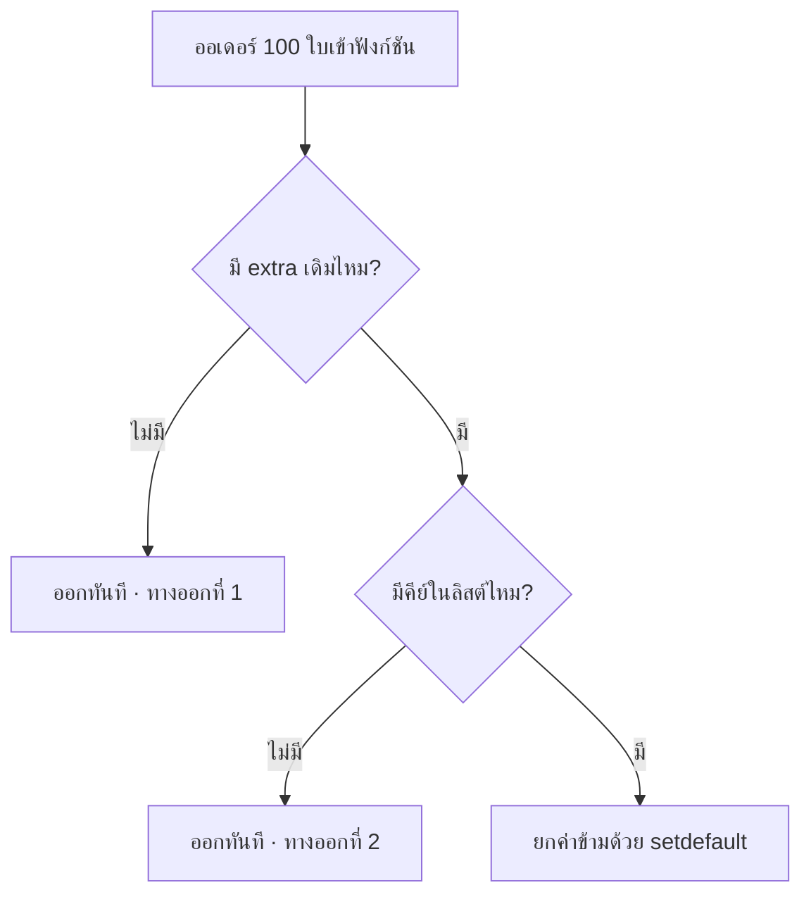

## 1 · ทริกเกอร์ — แขวนที่กิ่งไหน และทำไมกิ่งนั้น

```python title="services/dobybot/services/etax_invoice/etax_service.py" lines="213–226"
if errors:
    ...  # เขียน order_json.extra.auto_etax_errors (ของเดิม)

    # DBT-337: ตรงนี้คือจุดเดียวที่ระบบรู้ว่า "ออกเอกสารอัตโนมัติให้ไม่ได้"
    # จึงเป็นที่แขวนงานส่งลิงก์หน้า ETax Link ให้ผู้ซื้อไปกรอกข้อมูลเอง
    # ไม่ผูกกับสาเหตุใดสาเหตุหนึ่ง (ข้อมูลถูกปิดบัง/อีเมลว่าง/เลขสาขาผิดรูป)
    # marketplace อื่นที่เริ่มปิดบังบ้างจึงทำงานได้ทันทีโดยไม่ต้องแก้โค้ด
    #
    # import แบบ deferred เพื่อเลี่ยง circular import
    from etax.utils.etax_link_notify import maybe_enqueue_etax_link_notify

    maybe_enqueue_etax_link_notify(po)
else:
    create_auto_etax_task(po)
```

**สิ่งที่ตัดสินใจถูกและควรสังเกต:** ทริกเกอร์แขวนที่ `if errors:` *ทั้งก้อน* ไม่ใช่ที่ `if "customername" in errors and is_masked(...)` ผลคือวันที่ Shopee หรือ TikTok เริ่มปิดบังข้อมูลบ้าง ฟีเจอร์นี้**ทำงานทันทีโดยไม่ต้องแก้โค้ดสักบรรทัด** (สเปกข้อ D2 · US27) ราคาที่จ่ายคือมันจะยิงกับ*ทุก*สาเหตุที่ validate ไม่ผ่าน รวมถึงสาเหตุที่ผู้ซื้อแก้เองไม่ได้ — ซึ่งยอมรับได้ เพราะปลายทางของทุกสาเหตุคือ “ต้องให้ผู้ซื้อกรอกข้อมูลจริงเข้ามาเอง” เหมือนกันหมด

**ทางเลือกที่ไม่ได้เลือก:** สร้าง cron ไล่ query หาออเดอร์ที่มี `auto_etax_errors` แล้วยังไม่ถูกส่ง — ไม่ต้องแตะ `etax_service.py` เลย แต่ต้องมี query ที่สแกนตารางออเดอร์เป็นระยะ และเพิ่มความหน่วงระหว่าง “ระบบรู้ว่าออกไม่ได้” กับ “ผู้ซื้อได้รับแจ้ง” ซึ่งสำคัญมากเพราะร้านกลุ่มหนึ่งเปิดหน้าต่างเวลาไว้แค่ 10 วัน

## 2 · ฝั่ง enqueue ตรวจแค่ 3 อย่าง

```python title="services/dobybot/etax/utils/etax_link_notify.py" lines="106–124"
def maybe_enqueue_etax_link_notify(pick_order: PickOrder) -> bool:
    if not pick_order.order_marketplace:
        # ออเดอร์หน้าร้าน / ขายส่ง / B2B ที่เข้ามาทาง Zort
        return False

    if not pick_order.company.get_setting("ETAX_LINK_NOTIFY_ENABLE"):
        return False

    if is_etax_link_notified(pick_order):
        return False

    create_etax_link_notify_task(pick_order)
    return True
```

**ทำไมแค่ 3 อย่าง:** ฟังก์ชันนี้ทำงานอยู่ใน request ของ webhook ที่ dobysync ยิงเข้ามา ซึ่งเป็น request ที่ประมวลผลออเดอร์ทั้งชุด การเรียก API ภายนอกต่อออเดอร์จะถ่วง sync ทั้งชุดจน timeout ได้ สามข้อที่เหลือไว้จึงเป็นข้อที่**ตอบได้จาก object ที่มีอยู่ในมือแล้ว**: field บน model, setting ที่ cache แล้ว, และ dict ที่โหลดมาแล้ว — ไม่มี query ใหม่ ไม่มี HTTP

ที่เหลือ (ลิงก์ใช้ได้จริงไหม, มีอีเมลไหม, ร้านต่อแชทไหม) ผลักไปให้ handler ตัดสิน เพราะ**ต้องแตะฐานข้อมูลและระบบภายนอก**

| เทสต์ใน `test_etax_link_notify_enqueue.py` | ล็อกอะไร |
|---|---|
| `test_marketplace_order_that_fails_validation_creates_a_task` | เส้นทางหลัก |
| `test_valid_order_creates_no_notify_task` | ออเดอร์ที่ validate ผ่าน ต้องไม่ยุ่ง |
| `test_non_marketplace_order_creates_no_task` | ด่านที่ 1 (US15 — ไม่ส่งฟอร์มภาษีไปหาลูกค้า B2B) |
| `test_switch_off_creates_no_task`
`test_company_that_never_configured_anything_creates_no_task` | ด่านที่ 2 — **สองตัวไม่ซ้ำกัน**: ตัวแรกคือร้านที่ตั้งค่าเป็น `false` ตัวหลังคือร้านที่*ไม่เคยแตะ setting เลย* ซึ่งเป็นสถานะของร้านเกือบทั้งหมดบน prod และเป็นเคสที่ US11 แคร์จริง ๆ |
| `test_already_notified_order_creates_no_task_on_next_sync` | ด่านที่ 3 |
| `test_task_id_is_deterministic_per_company_and_order` | การกันงานซ้ำระดับ Cloud Tasks |
| `test_marker_survives_the_next_sync` | **เทสต์ตัวเดียวที่คุ้มครองหัวข้อ 4 ข้างล่าง** |

:::note
**รายละเอียดของ repo นี้ที่ทำให้เทสต์กลุ่มนี้เขียนยาก:** ตอนรันเทสต์ ตัวสร้าง Cloud Task ถูกแทนด้วยของปลอมที่ **โยน exception** (`FakeCloudTasksError`) ไม่ใช่ของปลอมแบบเงียบ — จงใจ เพื่อไม่ให้เทสต์เผลอเดินผ่านเส้น enqueue โดยไม่รู้ตัว เทสต์ที่วิ่งผ่านเส้นนี้จึง**ต้อง** mock ที่ boundary เสมอ และต้อง mock ด้วย `mock.patch.object` ไม่ใช่ `mock.patch("string.path")`
:::

## 3 · Cloud Task — id คงที่ + queue แยก

```python title="services/dobybot/cloudtasks/tasks.py" lines="576–589"
return create_task(
    queue="etax-link-notify",
    url=f"{BASE_URL}/api/etax/link-notify/tasks/handler/",
    payload={
        "company": pick_order.company_id,
        "order_number": pick_order.order_number,
    },
    task_id=(
        f"etax-link-notify--c{pick_order.company_id}"
        f"--on{pick_order.order_number}"
    ),
)
```

**สองสิ่งที่ทำงานคู่กันแต่ไม่ทดแทนกัน** — จุดนี้เป็นแก่นของดีไซน์ทั้งฟีเจอร์:

|  | task id คงที่ | เครื่องหมาย `etax_link_notified_at` |
|---|---|---|
| กันอะไร | งานซ้ำตอน sync เข้ารัว ๆ ในช่วงเวลาสั้น ๆ | การส่งซ้ำตลอดอายุของออเดอร์ |
| อยู่ได้นานแค่ไหน | **ไม่ถาวร** — Cloud Tasks จำ id ที่เพิ่งใช้ไปได้ระยะหนึ่งเท่านั้น | ถาวร (อยู่ใน DB) |
| ถ้ามีแต่ตัวนี้ | ผู้ซื้อโดนส่งซ้ำเมื่อผ่านไปนานพอ | งานซ้ำหลายใบเข้าคิวพร้อมกันตอน sync รัว ๆ |

queue แยกจาก `auto-etax` เพราะ queue นั้นเป็น**ท่อเรียงเดี่ยว 1 งาน/วินาที** ถ้าเอางานส่งข้อความไปแทรก จะไปหน่วงการออกเอกสารจริงซึ่งสำคัญกว่า (US22) และ queue ใหม่ยัง**ทำหน้าที่ที่สองเป็น kill switch** ที่ pause ได้ตอนตีสามโดยไม่ต้อง deploy — ต่างจากการปิด setting ตรงที่**งานที่ค้างอยู่ไม่หายไป** (US18)

## 4 · 🚨 การเปลี่ยนที่สเปกไม่ได้ขอ — แตะ hot path ของ sync

### ปัญหาที่มันแก้ (จริง และหนัก)

เครื่องหมาย “ส่งแล้ว” เก็บใน `order_json["extra"]["etax_link_notified_at"]` แต่ทุกรอบ sync `update_from_zort_order` จะเอา payload ที่ dobysync ส่งมา**ทับ `order_json` ทั้งก้อน** และ payload นั้น*ไม่มี* `extra` (serializer เติม `{}` ให้)

ผลถ้าไม่ทำอะไร: เครื่องหมายหายทุกรอบ sync → ฝั่ง enqueue เห็นว่า “ยังไม่เคยส่ง” → สร้างงานใหม่ → **ผู้ซื้อได้รับอีเมล/แชทซ้ำทุกครั้งที่ออเดอร์ sync** ซึ่งชนกับ US6 (“ไม่อยากถูกทวงซ้ำ”) ตรง ๆ และเป็นความล้มเหลวที่ลูกค้าเห็นก่อนเราเสมอ

### วิธีแก้ที่เลือก

```python title="services/dobybot/picking/models/models.py" lines="45–55"
# DBT-337: เวลาที่ระบบส่งลิงก์หน้า ETax Link ให้ผู้ซื้อสำเร็จ (ISO string)
ETAX_LINK_NOTIFIED_AT = "etax_link_notified_at"

# คีย์ใน order_json["extra"] ที่เป็น **สถานะฝั่งเรา** ไม่ใช่ข้อมูลจาก marketplace
# payload ที่ sync เข้ามาไม่มี extra (serializer เติม {} ให้) ทุกรอบ sync จึงทับ extra
# เดิมทิ้งทั้งก้อน คีย์ในลิสต์นี้ต้องยกข้ามมาเอง ไม่งั้นเครื่องหมาย "ส่งลิงก์แล้ว" จะหาย
# แล้วผู้ซื้อโดนส่งซ้ำทุกรอบ sync
EXTRA_KEYS_PRESERVED_ON_SYNC = (ETAX_LINK_NOTIFIED_AT,)
```

```python title="services/dobybot/picking/models/models.py" lines="396–418"
def _carry_over_extra_keys(self, order: dict) -> None:
    """ยกคีย์สถานะฝั่งเราใน order_json["extra"] ข้ามมาที่ payload ที่ sync เข้ามา"""
    old_extra = self.order_json.get("extra") if self.order_json else None
    if not isinstance(old_extra, dict):
        return                                    # ← ทางออกที่ 1

    preserved = {
        key: old_extra[key]
        for key in EXTRA_KEYS_PRESERVED_ON_SYNC
        if old_extra.get(key)
    }
    if not preserved:
        return                                    # ← ทางออกที่ 2

    new_extra = order.get("extra")
    if not isinstance(new_extra, dict):
        new_extra = {}
        order["extra"] = new_extra
    for key, value in preserved.items():
        new_extra.setdefault(key, value)          # ← payload ชนะเสมอ
```

เรียกที่ `models.py:504` ทันทีก่อน `self.order_json = order`

### ทำไมนี่คือ 🚨 ทั้งที่โค้ดดูสะอาด

ไล่สเปก #218 และ #225 ทีละบรรทัดแล้ว — **ไม่มีที่ไหนพูดถึงการแตะเส้น sync เลย** D4 พูดแค่ว่า “ใช้ marker `order_json.extra.etax_link_notified_at`” คนเขียนสเปกสันนิษฐานว่าเขียนลง `extra` แล้วมันจะอยู่ ซึ่งไม่จริง นี่คือ**ความจำเป็นที่ค้นพบตอน implement** ไม่ใช่การทำเกินแบบไร้เหตุผล แต่มันยังเข้าข่าย “ไม่ได้ขอ แต่ทำ” เต็ม ๆ เพราะ:

1. `update_from_zort_order` คือ**เส้นที่ร้อนที่สุดเส้นหนึ่งในระบบ** — ทุกออเดอร์ ทุกบริษัท ทุกรอบ sync วิ่งผ่าน บั๊กตรงนี้ไม่ได้กระทบแค่ฟีเจอร์นี้ แต่กระทบ*ทุกอย่าง*
2. ไม่มี reviewer คนไหนที่อ่านตั๋ว #225 (“แจ้งลิงก์ทางอีเมล”) แล้วจะ**คาดหวังว่าต้องไปรีวิว `picking/models/models.py`**
3. มันสร้าง**ช่องทางใหม่**ที่จะโตขึ้นเรื่อย ๆ — `EXTRA_KEYS_PRESERVED_ON_SYNC` เป็น tuple ที่เชิญชวนให้คนต่อ ๆ ไปเพิ่มคีย์เข้าไป และทุกคีย์ที่เพิ่มก็จะทำงานในเส้นเดียวกันนี้

### สิ่งที่ลดความเสี่ยงลง (และตรวจแล้วว่าจริง)



- **ไม่มี I/O ใด ๆ** — เป็น dict operation ล้วน ไม่แตะ DB ไม่เรียกอะไรออกนอก
- **ใช้ `setdefault` ไม่ใช่ assignment** — ถ้าวันหนึ่ง payload ส่ง `extra.etax_link_notified_at` มาเอง ค่าใหม่ชนะ ค่าเก่าไม่ย้อนมาทับ
- **`if old_extra.get(key)` ไม่ใช่ `if key in old_extra`** — ค่า falsy (`null`, `""`) ไม่ถูกยกข้ามมา จึงไม่ปล่อยขยะเข้า payload ใหม่
- เขียนกลับด้วย `save(update_fields=["order_json"])` ที่ฝั่ง marker — คอลัมน์เดียว

### ทางเลือกที่ไม่ได้เลือก และเทียบราคากันจริง ๆ

| ทางเลือก | ข้อดี | ทำไมไม่เลือก |
|---|---|---|
| **คอลัมน์ใหม่บน `PickOrder`**
`etax_link_notified_at = DateTimeField(null=True)` | ไม่ต้องแตะ `update_from_zort_order` เลย · query ได้ตรง ๆ · index ได้ · รายงาน “ออเดอร์ไหนถูกแจ้งแล้วบ้าง” เขียนง่าย | ต้อง migration บนตารางออเดอร์ซึ่งใหญ่ · **แต่เป็น `ADD COLUMN` ที่ nullable ซึ่งบน Postgres สมัยใหม่แทบไม่ล็อกเลย** — เหตุผลนี้จึงอ่อนกว่าที่คิด *นี่คือทางเลือกที่ผมคิดว่าคุ้มค่าที่จะถกก่อน merge* |
| ตารางแยก `ETaxLinkNotifyLog` | ไม่แตะของเดิมเลย · เก็บประวัติได้หลายรอบ | ตารางใหม่ + query เพิ่มในเส้น enqueue ซึ่งอยู่ใน request ของ webhook — แพงกว่าที่ต้องการ |
| ไม่ทำอะไร ใช้ `SmsLog` เป็นเครื่องหมาย | ไม่มีโค้ดใหม่เลย | ต้อง query ตาราง 41.9 ล้านแถวในเส้น enqueue ทุกออเดอร์ — ตัดทิ้งได้ทันที |

### ตาข่ายที่รองอยู่ตอนนี้: เทสต์ตัวเดียว

`test_marker_survives_the_next_sync` คือเทสต์**ตัวเดียว**ที่คุ้มครองเรื่องนี้ มันยิงเข้า endpoint sync จริงสองรอบแล้ว assert ว่ารอบสองไม่สร้าง task ใหม่ — เป็นการทดสอบที่*ระดับพฤติกรรมที่ถูกต้อง* (ไม่ผูกกับชื่อ `_carry_over_extra_keys`) แต่มันครอบเฉพาะ**เส้นทางที่ฟีเจอร์นี้ใช้** ไม่มีเทสต์ไหนถามว่า “แล้ว `extra` คีย์*อื่น*ล่ะ ยังถูกทับตามเดิมไหม” ซึ่งเป็นสิ่งที่คนแก้ต่อ อาจทำหลุดได้ง่ายเวลาเพิ่มคีย์เข้า `EXTRA_KEYS_PRESERVED_ON_SYNC`

```console
task test:dobybot -- etax.tests.test_etax_link_notify_enqueue
Ran 8 tests — OK
```

## 5 · ผลกระทบต่องานในอนาคต

- `EXTRA_KEYS_PRESERVED_ON_SYNC` กลายเป็น**จุดขยายอย่างเป็นทางการ**สำหรับ “สถานะฝั่งเราที่ต้องรอด sync” ทุกคีย์ที่เพิ่มเข้าไปในอนาคตจะทำงานในเส้นที่ร้อนที่สุด ควรมีกฎว่าเพิ่มได้ก็ต่อเมื่ออ่านหน้านี้แล้ว
- ถ้าวันหนึ่งต้องรู้ว่า “ออเดอร์ไหนถูกแจ้งแล้ว” ในเชิงรายงาน จะเจอความเจ็บทันที เพราะ query `order_json->'extra'->>'etax_link_notified_at'` บนตารางออเดอร์**ไม่มี index** — ตอนนั้นคอลัมน์จริงจะกลายเป็นทางที่ถูกกว่าอยู่ดี
