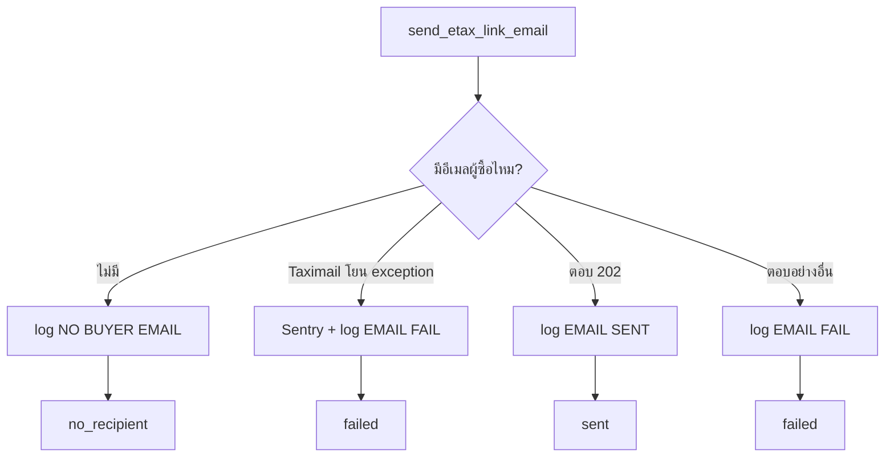

## สัญญาข้อเดียวที่คุมทั้งไฟล์

:::tldr
### “handler ต้องตอบสำเร็จเสมอ”

- queue ตั้ง `maxAttempts=1` อยู่แล้ว — retry ไม่มี การตอบ 500 จึงไม่ได้ช่วยให้ลองใหม่
- สิ่งเดียวที่การตอบ 500 ทำได้คือ**ทำให้ error rate ของ Cloud Run สื่อผิด** จนวันหนึ่งของจริงพังแล้วไม่มีใครสังเกต
- กลไก retry ตัวจริงคือ**รอบ sync ถัดไป** ซึ่งจะพิจารณาออเดอร์นี้ใหม่เองตราบใดที่ยังไม่ปั๊มเครื่องหมาย
:::

สัญญานี้อธิบายเกือบทุกการตัดสินใจในไฟล์: ทำไม `send_etax_link_email` คืน*สตริงผลลัพธ์* แทนที่จะโยน exception, ทำไม `build_chat_message` คืน tuple `(ข้อความ, เหตุผล)`, ทำไมมี `try/except Exception` กว้าง ๆ สามจุด — และทำไมสองบั๊กที่เจอในรอบ review ถึงเป็นบั๊ก*ระดับเดียวกัน* ทั้งที่โค้ดคนละที่

อ่านโค้ดตามลำดับที่คำขอเดินจริงได้ที่ :read[handler → ช่องทาง → log]{list="rl-handler"} — 5 ช่วง เริ่มจากปากทาง จบที่ตัวเขียน log ที่ทุกกรณีเรียก

## 1 · handler — ปากทางที่บางที่สุดเท่าที่จะบางได้

```python title="services/dobybot/etax/views/etax_link_notify_views.py" lines="29–54"
def post(self, request):
    validator = self.Validator(data=request.data)
    validator.is_valid(raise_exception=True)
    data = validator.validated_data
    company: Company = data["company"]

    pick_order = PickOrder.objects.filter(
        company=company,
        order_number=data["order_number"],
    ).first()
    if not pick_order:
        # ออเดอร์อาจถูกลบไปหลังงานเข้าคิว — ไม่ใช่ความผิดพลาดของระบบ
        return Response({"status": "ignored", "reason": "ORDER_NOT_FOUND"})

    # ออเดอร์ที่ถูกแยกออกมาต้องใช้ออเดอร์หลัก แบบเดียวกับหน้า public — หาไม่เจอได้
    # (`get_main_order` ใช้ `.first()`) และอ่าน `order_json["integrationName"]`
    # แบบ KeyError ได้ ทั้งสองกรณีต้องไม่กลายเป็น 500
    try:
        main_order = pick_order.get_main_order()
    except KeyError:
        main_order = None
    if not main_order:
        return Response({"status": "ignored", "reason": "MAIN_ORDER_NOT_FOUND"})

    result = notify_etax_link(company, main_order)
    return Response(result)
```

**ทุกอย่างในนี้คือการหลบ 500** — `filter().first()` แทน `get_object_or_404()`, และบล็อก `try/except KeyError`

:::note
**บล็อก `try/except KeyError` นั้นไม่ได้อยู่ในโค้ดตอนแรก** มันถูกเพิ่มในคอมมิตสุดท้าย (`1ebc4cf`) หลังรอบ code review `get_main_order()` ล้มได้สองแบบ — คืน `None` เพราะใช้ `.first()` และโยน `KeyError` เพราะอ่าน `order_json["integrationName"]` ตรง ๆ โค้ดตอนแรกเรียก `notify_etax_link(company, pick_order.get_main_order())` ลอย ๆ ซึ่งทำให้ทั้งสองกรณีกลายเป็น 500 **ผิดสัญญาข้อเดียวที่ทั้งไฟล์ยืนอยู่บนมัน**
:::

ประเด็นที่น่าเรียนจากตรงนี้: บั๊กนี้**ไม่ได้เกิดจากความไม่รู้** — ทุกบรรทัดใน `notify_etax_link` ระวังเรื่องนี้อย่างดี แต่จุดที่หลุดคือ*บรรทัดกาว* ที่ดูเหมือนไม่มีตรรกะอะไรเลย ที่ที่คนอ่านผ่านเร็วที่สุดคือที่ที่ข้อสมมติหลุดง่ายที่สุด

## 2 · `notify_etax_link` — ตัวประสาน

```python title="services/dobybot/etax/utils/etax_link_notify.py" lines="488–523"
if is_etax_link_notified(pick_order):
    return {"status": "skipped", "reason": "ALREADY_NOTIFIED"}

tax_document = get_latest_active_tax_document(company, pick_order)
eligibility = check_etax_link_eligibility(
    company, pick_order, tax_document=tax_document
)
if not eligibility.is_allowed:
    return {"status": "skipped", "reason": eligibility.reason.value}

channel = (company.get_setting("ETAX_LINK_NOTIFY_CHANNEL") or "").strip().lower()
if channel not in (CHANNEL_EMAIL, CHANNEL_CHAT, CHANNEL_BOTH):
    channel = CHANNEL_EMAIL
results = {}

if channel in (CHANNEL_EMAIL, CHANNEL_BOTH):
    results["email"] = send_etax_link_email(company, pick_order)

# ไม่ fallback ข้ามช่องทางในทุกกรณี
if channel in (CHANNEL_CHAT, CHANNEL_BOTH):
    results["chat"] = send_etax_link_chat(company, pick_order)

sent = RESULT_SENT in results.values()
if sent:
    mark_etax_link_notified(pick_order)

return {"status": "sent" if sent else "not_sent", "channels": results}
```

สังเกตว่าเรียก `check_etax_link_eligibility` **โดยไม่ส่ง `is_staff`** — ค่าเริ่มต้นคือ `False` จงใจ เพราะคนที่จะกดลิงก์คือผู้ซื้อ ไม่ใช่ staff ถ้าเผลอส่ง `is_staff=True` มา ระบบจะส่งลิงก์ที่ผู้ซื้อกดแล้วขึ้น error ออกไป

### การไม่ fallback ข้ามช่องทาง — ทำไมถึงเป็นเรื่องความปลอดภัย ไม่ใช่เรื่อง UX

ร้านที่ตั้งช่องทางเป็น `chat` แล้วส่งแชทไม่ได้ ระบบ**ต้องไม่ไปส่งอีเมลแทน** ทั้งที่ดูเผิน ๆ การ fallback น่าจะดีกว่า เหตุผลอยู่ที่ policy: ข้อความแชทเป็นของที่ staff ควบคุมเพราะ Lazada บล็อกข้อความเชิงโฆษณา ถ้าระบบ fallback ไปยิงช่องอื่นเอง **shop ที่ไม่เคยตรวจข้อความเลยจะมีข้อความออกไป โดยไม่มีใครตั้งใจ** ร้านที่อยากได้ทั้งสองทางตั้ง `both` ได้อยู่แล้ว — การมีตัวเลือกที่ชัดเจนอยู่แล้ว ทำให้ fallback อัตโนมัติกลายเป็นการเดาใจที่ไม่จำเป็น

### 🚨 การ normalize ค่า channel — แก้ปัญหาจริง แต่แลกมาด้วยความเงียบ

สองบรรทัด `.strip().lower()` + fallback ไม่ได้อยู่ในสเปกและถูกเพิ่มหลัง review ปัญหาที่มันแก้ร้ายแรงกว่าที่เห็น: ถ้าค่าเป็น `"Email"` หรือ `" chat "` (ตั้งมาจาก `set_setting()` ที่อื่น หรือข้อมูลเก่าก่อนมี dropdown) มันจะ**ไม่เข้าสาขาไหนเลย** → `results` ว่าง → ไม่ปั๊มเครื่องหมาย → รอบ sync ถัดไปสร้างงานใหม่ → **วนแบบนี้ตลอดกาลโดยไม่มี log สักแถวและไม่มี error สักตัว**

**ราคาที่จ่าย:** ตอนนี้ค่าที่พิมพ์ผิด (เช่น `"emial"`) จะ**ส่งอีเมลออกไปเงียบ ๆ** แทนที่จะดังขึ้นมา ทางเลือกที่ถกได้: เขียน log หนึ่งแถวว่า “ค่า channel อ่านไม่ออก ใช้ค่าเริ่มต้นแทน” ก่อนจะ fallback — ได้ทั้งความทนทานและความเห็น

## 3 · ช่องทางอีเมล — 4 ทางออก แต่ละทางเขียน log หนึ่งแถว



**ทางออกที่ 4 คือทางที่คนลืมบ่อยที่สุด** — Taximail ตอบ HTTP 200 แต่ไม่ใช่ 202 ก็แปลว่าไม่ได้รับเข้าคิวส่ง ถ้าเช็คแค่ `response.ok` จะนับว่าสำเร็จแล้วปั๊มเครื่องหมายทิ้งไป ผู้ซื้อจะไม่มีวันได้รับอะไรและ**ไม่มีรอบ sync ไหนมาลองใหม่ให้**

```python title="services/dobybot/etax/utils/etax_link_notify.py" lines="140–152"
def get_buyer_email(pick_order: PickOrder) -> str:
    """อีเมลที่ marketplace ส่งมาในฐานะ **ผู้ขอใบกำกับภาษี** เท่านั้น

    จงใจไม่ fallback ไปใช้อีเมลผู้รับสินค้า (`shippingemail`) แบบเส้นอีเมลแจ้งพร้อมส่ง
    เพราะลิงก์ e-tax ต้องไปถึงคนที่กดขอใบกำกับภาษี ไม่ใช่คนรับของ
    """
    email = pick_order.order_json.get("customeremail") or ""
    email = str(email).strip()
    if not email or email == DO_NOT_SEND_EMAIL:
        return ""
    if ";" in email:
        email = email.split(";")[0].strip()
    return email
```

สามอย่างที่ฟังก์ชันสั้น ๆ นี้ตัดสิน: (ก) **ไม่ fallback ไป `shippingemail`** — ของขวัญที่ส่งให้คนอื่นจะทำให้ใบกำกับภาษีไปหาผิดคน · (ข) `DO_NOT_SEND_EMAIL` เป็น sentinel ที่**มีอยู่แล้วทั้งระบบ** (ใช้ใน `d1a_schema.py`, `taximail.py`, `express_etax.py`) ไม่ใช่ของที่คิดขึ้นใหม่ · (ค) หลายอีเมลคั่นด้วย `;` เอาตัวแรก

## 4 · ช่องทางแชท — ที่ที่ความซับซ้อนอยู่จริง

### เลือกตัวส่งด้วยชื่อ method เป็นสตริง

```python title="services/dobybot/etax/utils/etax_link_notify.py" lines="67–71"
CHAT_SENDER_BY_MARKETPLACE = {
    "lazada": ("send_lazada_chat", SmsLog.CHANNEL_LAZADA_CHAT, "Lazada"),
    "shopee": ("send_shopee_chat", SmsLog.CHANNEL_SHOPEE_CHAT, "Shopee"),
}
```

แล้วเรียกด้วย `getattr(messaging, sender_name)(...)` **จุดที่รอบ review ทักไว้และยังไม่ได้แก้:** การอ้าง method ด้วยสตริงทำให้ เครื่องมือ “หา reference” และ “rename symbol” มองไม่เห็น ถ้าใครเปลี่ยนชื่อ `send_lazada_chat` โค้ดจะ**คอมไพล์ผ่าน เทสต์ที่ไม่ได้แตะแชทก็ผ่าน** แล้วพังตอน runtime · ทางเลือกที่ตรงกว่าคือเก็บ callable ไว้เลย (`MessagingService.send_lazada_chat`) แต่ต้อง import ที่ระดับโมดูล ซึ่งชนกับ deferred import ที่ใช้กัน circular import อยู่ — **เป็น trade-off ที่ควรบันทึกไว้ ไม่ใช่ควรเถียง**

### ห้าทางออก และเหตุผลของแต่ละทาง

| สถานการณ์ | `status.reason` ใน log | ผล | ทำไมต้องเขียน log เอง |
|---|---|---|---|
| marketplace ไม่มีตัวส่ง (TikTok) | `NO_CHAT_SENDER` | `no_recipient` | ไม่มีใครเขียนให้ — ถ้าไม่ทำจะเงียบสนิท |
| ประกอบข้อความไม่ได้ | `NO_TEMPLATE` / `SHORTEN_FAILED` / `TEMPLATE_INVALID` | `failed` | ยังไม่ถึงตัวส่งกลาง |
| ตัวส่งกลางโยน exception | `CHAT_ERROR` | `failed` | + ส่ง Sentry เพราะเป็นระบบภายนอกล้ม |
| **ร้านยังไม่ได้ต่อแชท** | `CHAT_NOT_CONNECTED` | `no_recipient` | **ตัวส่งกลางคืน `None` เงียบ ๆ** โดยไม่เขียนอะไรเลย — และเป็นสภาพของ **16 จาก 24 ร้าน**ที่เปิด auto-create |
| ส่งสำเร็จ / ไม่สำเร็จ | ตัวส่งกลางเขียนให้ | ดู `log.status["name"] == "DELIVERED"` | — |

:::note
**ทำไมไม่ไปแก้ตัวส่งแชทกลางให้เขียน log เองซะเลย** (สเปกข้อ D25 ห้ามไว้) — เพราะ `send_lazada_chat` ถูกใช้โดยข้อความ “พร้อมส่ง” ด้วย ถ้าไปเติม log ตรงนั้น **ร้าน 16 ร้านที่ไม่ได้ต่อแชทจะได้แถวเปล่าเพิ่มขึ้นหนึ่งแถวต่อ*ทุกออเดอร์*** บนตารางที่มีอยู่แล้ว 41.9 ล้านแถว การแก้ที่ดูสะอาดกว่าจึงแพงกว่ามาก
:::

### สองรูปแบบข้อความ โดยไม่มี flag

```python title="services/dobybot/etax/utils/etax_link_notify.py" lines="364–384"
template = company.get_setting("ETAX_LINK_NOTIFY_CHAT_MESSAGE") or ""
if not template.strip():
    return None, "NO_TEMPLATE"

values = {"order_number": pick_order.order_number}

if CHAT_LINK_VARIABLE in template:
    # โหมด "ไปดูอีเมล" (template ไม่มีตัวแปรลิงก์) ไม่ต้องย่อลิงก์เลย
    short_link = shorten_url(
        build_etax_link(company, pick_order), domain=ETAX_LINK_SHORTEN_DOMAIN
    )
    if not short_link:
        return None, "SHORTEN_FAILED"
    values["etax_link"] = short_link

try:
    return safe_format(template, **values), None
except Exception as error:  # template มาจากมือ staff จึงผิดรูปได้
    sentry_sdk.capture_exception(error)
    return None, "TEMPLATE_INVALID"
```

**ดีไซน์ที่ฉลาดที่สุดใน PR นี้:** การมี/ไม่มี `{etax_link}` ใน template *คือ*สวิตช์ระหว่าง “ข้อความแนบลิงก์” กับ “ข้อความบอกให้ไปดูอีเมล” ไม่ต้องมี flag แยก ผลคือถ้าวันหนึ่งพบว่า Lazada บล็อกโดเมน `etax.me` จริง **staff แก้ข้อความอย่างเดียว ไม่ต้อง deploy** — และการเช็ค `if CHAT_LINK_VARIABLE in template` ก่อนย่อลิงก์ยังทำให้โหมดหลังไม่ยิงตัวย่อลิงก์ทิ้งเปล่า ๆ

### 🐛 บั๊กที่สอง — `safe_format` ที่ไม่ safe อย่างที่ชื่อบอก

`safe_format` คือ `template.format_map(defaultdict(str, values))` ชื่อมันชวนให้เชื่อว่ากลืนทุกอย่าง **แต่มันกลืนได้แค่ “ตัวแปรที่ไม่รู้จัก”** ปีกกาเดี่ยว ๆ ที่ไม่ครบคู่ยังทำให้ `format_map` โยน `ValueError` อยู่ดี

โค้ดตอนแรกเรียก `build_chat_message()` **นอก** try/except แปลว่า staff ที่พิมพ์ `{` เกินมาตัวเดียวในหน้า admin จะทำให้ **handler ตอบ 500** — และเพราะ `ETAX_LINK_NOTIFY_CHAT_MESSAGE` เป็นค่าที่มนุษย์พิมพ์เองผ่านฟอร์ม มันจึงไม่ใช่กรณีสมมติ แก้แล้วในคอมมิต `1ebc4cf` โดยเปลี่ยน return type เป็น tuple พร้อมแยกเหตุผลออกเป็น 3 แบบ ซึ่งจำเป็นเพราะ**ทั้งสามอย่างแก้คนละที่**:

- `NO_TEMPLATE` → ปัญหา config ของร้าน (staff ไปตั้งข้อความให้)
- `SHORTEN_FAILED` → ระบบภายนอกล้ม (รอ / ดูตัวย่อลิงก์)
- `TEMPLATE_INVALID` → staff พิมพ์ปีกกาไม่ครบคู่ (ไปแก้ข้อความ)

ถ้ารวบเป็น `"BUILD_FAILED"` เดียว คนที่ดู log ตอน rollout จะแยกไม่ออกว่าต้องไปหาใคร

## 5 · log — ทุกความพยายามส่งทิ้งร่องรอย

```python title="services/dobybot/etax/utils/etax_link_notify.py" lines="211–224"
return SmsLog.objects.create(
    company=company,
    sender=sender[:60],
    bulk_id=uuid4(),
    message_id=message_id or uuid4(),
    credit=0,
    to=to[:200],
    status=status,
    text=text,
    remark=ETAX_LINK_NOTIFY_REMARK,     # "ETAX-LINK-NOTIFY"
    campaign=None,
    status_timestamp=timezone.now(),
    channel=channel,
)
```

- `credit=0` — US13: ข้อความแจ้งเรื่องภาษีไม่ใช่ SMS จึงไม่ควรถูกนับเป็นเครดิตของร้าน
- `remark` ประจำฟีเจอร์ — เป็น**ตัวกรองตัวเดียว**ที่แยกแถวของฟีเจอร์นี้ ออกจากอีก 41.9 ล้านแถวได้
- ตัดสตริงด้วย `[:60]` / `[:200]` — ชื่อร้านยาว ๆ ไม่ควรทำให้ `create()` พัง ซึ่งจะกลายเป็น 500 อีกทาง
- **ไม่ใช้ helper log ของอีเมล ready-to-ship** (D26) เพราะ helper นั้นตั้ง remark ตายตัว และเลือกผู้รับจาก `shippingemail` ก่อน ซึ่งผิดสำหรับลิงก์ e-tax

### ⚠️ ช่องว่างที่ยังเหลือ — ด่าน eligibility ไม่ทิ้งร่องรอยอะไรเลย

สังเกตใน `notify_etax_link`: เมื่อไม่ผ่านด่าน มันแค่ `return {"status": "skipped", "reason": ...}` — **ไม่เขียน log ไม่ยิง Sentry** ร่องรอยเดียวคือ response body ที่ตอบกลับ Cloud Tasks ซึ่งไม่มีใครเก็บ

**เป็นธรรมกับโค้ด:** สเปกข้อ D24 ระบุ 4 กรณีที่ต้องเขียน log และทั้ง 4 คือ “ความพยายาม*ส่ง*” การถูกปัดตกก่อนถึงขั้นส่งจึงไม่ผิดสเปกตามตัวอักษร และ Testing Decisions ของ #218 ก็เขียนว่าเคสนี้ “ต้องไม่ส่งและไม่ปั๊ม marker” เท่านั้น

**แต่ในทางปฏิบัติมันคือหลุมของ rollout:** ถ้าร้านนำร่องเป็นหนึ่งใน 6 ร้านที่เปิด “ขอได้เมื่อรับของแล้ว” ออเดอร์ส่วนใหญ่จะติดด่านนี้ คนที่มาไล่หาสาเหตุจะเจอ **SmsLog ว่าง, Sentry ว่าง, setting เปิดอยู่ถูกต้อง** แล้วตัน ต้องไปอ่านโค้ดหรือ query `picking_pickorder` เทียบวันที่กับ `is_confirm_received` เอง ซึ่งไม่ใช่สิ่งที่คนรับ rollout ควรต้องทำ — และมันชนกับเจตนาของ US29 ที่เขียนว่าอยากให้ *“ทิ้งร่องรอยไว้ เพื่อที่จะ debug ตอน rollout ได้”*

**ทางแก้ที่เล็กมาก:** เขียน log หนึ่งแถวตอนถูกปัดตก โดยใช้ `reason` ที่ helper ตอบมาอยู่แล้ว (`order_not_received`, `past_order_open_days`, …) ประมาณ 20 บรรทัด + เทสต์ · **ข้อควรระวัง:** ออเดอร์ที่ติดด่านจะถูกพิจารณาใหม่ทุกรอบ sync ดังนั้นถ้าเขียนดื้อ ๆ จะได้แถวซ้ำเยอะมาก ต้องเขียนแค่ครั้งแรกหรือเปลี่ยนเมื่อ reason เปลี่ยน

## 6 · เทสต์ 33 ตัว — และสิ่งที่ mock / ไม่ mock

สิ่งที่ mock มี**แค่ 3 อย่าง** และทั้งสามคือขอบนอกจริง ๆ ของระบบ: ตัวส่งอีเมล (`send_taximail_raw`), ตัวส่งแชท (`MessagingService.send_*_chat`), ตัวย่อลิงก์ (`shorten_url`) — ที่เหลือรันของจริงทั้งหมด รวมถึง DB, การอ่าน setting, การเขียน `SmsLog` และด่าน eligibility ตัวจริง

### เทสต์ที่จับคู่กันเป็นชุด — อ่านเป็นคู่ถึงจะเห็นเจตนา

| คู่ | ล็อกอะไรร่วมกัน |
|---|---|
| `test_marker_is_stamped_only_after_a_successful_send`
 `test_failed_send_is_logged_and_leaves_no_marker`
 `test_buyer_without_email_is_logged_and_not_marked` | **เงื่อนไขการปั๊มเครื่องหมายจากทั้งสองฝั่ง** — ถ้ามีแค่ตัวแรก โค้ดที่ปั๊มเสมอก็ผ่าน ตัวที่สองและสามคือตัวที่ทำให้ “เฉพาะเมื่อสำเร็จ” เป็นสัญญาจริง |
| `test_both_channel_counts_as_sent_when_only_chat_succeeds`
 `test_both_channel_is_not_marked_when_no_channel_succeeds` | นิยามของ “สำเร็จ” ในโหมด `both` — **อย่างน้อยหนึ่งช่อง** ไม่ใช่ทุกช่อง และไม่ใช่ช่องใดช่องหนึ่งที่เจาะจง |
| `test_chat_failure_never_falls_back_to_email`
 `test_email_only_company_never_sends_chat` | การไม่ fallback ทั้งสองทิศทาง — assert ทั้ง “ไม่มีอีเมลถูกส่ง” และ “ไม่มีแชทถูกส่ง” ซึ่งเป็น**การ assert ว่าไม่มีอะไรเกิดขึ้น** ประเภทที่คนมักลืมเขียน |
| `test_exception_from_the_email_provider_still_answers_success`
 `test_unknown_order_answers_success_without_sending`
 `test_broken_template_is_logged_and_handler_still_answers_200` | **สัญญา “ตอบสำเร็จเสมอ” จากสามทิศ** — ระบบภายนอกล้ม, ข้อมูลหาย, ค่าที่มนุษย์พิมพ์ผิด |
| `test_channel_value_is_read_case_and_space_insensitively`
 `test_unknown_channel_value_falls_back_to_email_instead_of_going_silent` | ล็อกการ normalize ที่เพิ่มหลัง review ไว้ — ชื่อเทสต์ระบุ *“instead of going silent”* ซึ่งบันทึกว่ากำลังกันอะไรอยู่ ไม่ใช่แค่ว่าทำอะไร |
| `test_build_failures_are_told_apart_in_the_log` | assert ว่า `NO_TEMPLATE` กับ `SHORTEN_FAILED` ลง log **ต่างกัน** — ล็อกคุณค่าของการแยกเหตุผล ไม่ใช่แค่ล็อกว่ามี log |

### ที่ไม่มีเทสต์

- ไม่มีเทสต์ว่าด่าน eligibility ปัดตกแล้ว*ไม่*เขียน log — คือช่องว่างข้างบนไม่ได้ถูกล็อกไว้ทั้งสองทาง (ดี: แก้ได้โดยไม่ต้องแก้เทสต์เดิม)
- ไม่มีเทสต์เรื่อง `LAZADA_CHAT_DAILY_LIMIT` เต็ม — เป็นเส้นที่ตัวส่งกลางคืน `DAILY_LIMIT_REACHED` ซึ่งโค้ดเราจะนับเป็น `failed` ถูกต้องอยู่แล้ว แต่ไม่มีใครยืนยัน และ**ไม่มีใครประเมินว่าฟีเจอร์นี้จะกินโควตาของข้อความ “พร้อมส่ง” ไปเท่าไร**
- ไม่มีเทสต์ว่า `getattr(messaging, sender_name)` ยังหา method เจอ — ถ้ามีคน rename เทสต์แชท 18 ตัวจะพังพร้อมกัน ซึ่งจริง ๆ แล้วก็เป็นตาข่ายที่ใช้ได้

```console
task test:dobybot -- etax.tests.test_etax_link_notify_handler
Ran 15 tests — OK
task test:dobybot -- etax.tests.test_etax_link_notify_chat
Ran 18 tests — OK
```
