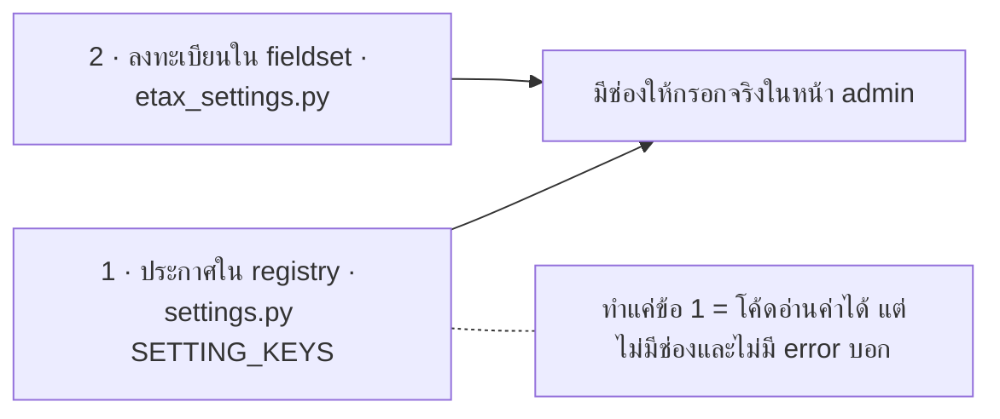

:::note
**ทำไมเป็น whitebox ทั้งที่ดูเหมือนงานประกาศค่า** — เพราะมี migration ซึ่งเป็นกฎบังคับ และเพราะข้อจำกัด “ห้าม backfill” เป็นความรู้ที่**ต้องส่งต่อให้คนดูแลต่อ** มิฉะนั้นวันหนึ่งจะมีคนเขียน migration ที่ล็อกตาราง 26 GB ตอน deploy
:::

## 1 · สามคีย์ใหม่ และเหตุผลของค่าเริ่มต้นแต่ละตัว

| คีย์ | ชนิด | ค่าเริ่มต้น | ทำไมเป็นค่านี้ |
|---|---|---|---|
| `ETAX_LINK_NOTIFY_ENABLE` | `bool` | **`"0"` = ปิด** | US11 — ร้านที่ไม่ได้ตั้งอะไรเลยต้องไม่มีข้อความออกไปหาลูกค้าโดยไม่ตั้งใจ · เป็นหลักประกันว่า merge แล้วโลกไม่เปลี่ยน |
| `ETAX_LINK_NOTIFY_CHANNEL` | `str` | `"email"` | **มาจากข้อมูล prod:** ใน 24 ร้านที่เปิด auto-create มี**เพียง 8 ร้านที่ต่อแชท Lazada** อีก 16 ร้านไม่ได้ต่อเลย ถ้าตั้งค่าเริ่มต้นเป็น chat ร้านส่วนใหญ่จะได้แค่แถว `CHAT_NOT_CONNECTED` ไม่มีใครได้รับอะไร |
| `ETAX_LINK_NOTIFY_CHAT_MESSAGE` | `str` | **ข้อความที่*มี*ลิงก์** | **มาจากข้อมูล prod เช่นกัน:** ในบันทึกข้อความ 100,000 แถวล่าสุด มีแชท Lazada 1,758 ใบ *ทุกใบมีลิงก์* ส่งถึง 92% และ 142 ใบที่ไม่ถึง**ไม่มีใบไหนล้มเพราะเนื้อหาเลย** (token หมดอายุ 91, token ผิด 40, ไม่พบ shop 9, rate limit 2) |

ทั้งสามตั้ง `allow_customer_to_edit=False` — **staff เท่านั้นที่แก้ได้ ผ่าน Django admin** เหตุผลไม่ใช่เรื่องความซับซ้อน แต่เป็นเรื่อง**ความปลอดภัยของ shop ลูกค้า**: Lazada มี policy บล็อกข้อความเชิงโฆษณา ร้านที่แก้ข้อความเองแล้วเผลอเขียนให้ดูเหมือนโปรโมชัน อาจทำให้ shop ถูกลงโทษ ซึ่งเป็นความเสียหายที่เราสร้างให้ลูกค้าโดยให้เครื่องมือที่คมเกินไป (US16)

## 2 · ⚠️ กับดักที่ต้องทำ*สองอย่าง* ไม่ใช่อย่างเดียว

การเพิ่ม company setting ใน repo นี้ต้องทำ **2 ที่เสมอ**:



```python title="companies/admin_views/settings_admin/groups/etax_settings.py" lines="110–121"
# ── แจ้งลิงก์ ETax Link ให้ผู้ซื้อ (DBT-337) ─────────────────
(
    "ETax Link Notify",
    "แจ้งลิงก์หน้า ETax Link ให้ผู้ซื้อ เมื่อออกเอกสารอัตโนมัติไม่ได้",
    [
        "ETAX_LINK_NOTIFY_ENABLE",
        "ETAX_LINK_NOTIFY_CHANNEL",
        "ETAX_LINK_NOTIFY_CHAT_MESSAGE",
    ],
    {"toggle_by": "ETAX_LINK_NOTIFY_ENABLE"},
),
```

`toggle_by` ทำให้อีกสองช่องซ่อนอยู่จนกว่าจะเปิดสวิตช์ — ลดโอกาสที่ staff จะไปแก้ข้อความแชทของร้านที่ยังไม่ได้เปิดฟีเจอร์

และมี field override ให้ช่องช่องทางเป็น dropdown แทน free text:

```python title="…/etax_settings.py" lines="199–206"
"ETAX_LINK_NOTIFY_CHANNEL": forms.ChoiceField(
    required=False,
    choices=[
        ("email", "email"),
        ("chat", "chat"),
        ("both", "both"),
    ],
),
```

:::note
dropdown คุมได้เฉพาะ**ทางเข้าทางหน้า admin** — `set_setting()` จากที่อื่นและข้อมูลเก่ายังใส่อะไรก็ได้ ซึ่งเป็นเหตุผลที่ฝั่ง `notify_etax_link` ต้อง normalize ค่าอีกชั้น (ดู หน้า 03) **สอง layer นี้ต้องมีทั้งคู่ ไม่ใช่ซ้ำซ้อน**
:::

เทสต์ 10 ตัวใน `test_etax_link_notify_settings.py` ครอบกับดักนี้ตรง ๆ: `test_keys_are_registered_in_the_etax_group`, `test_admin_form_renders_an_input_for_each_key`, `test_channel_field_is_a_dropdown` — สามตัวนี้จะแดงถ้าใครเพิ่มคีย์แล้วลืมขั้นที่ 2 ซึ่งเป็นการเปลี่ยน “ความรู้ในหัวคน” ให้เป็น “ตาข่ายในโค้ด”

อีกสองตัวที่น่าสังเกต: `test_keys_are_not_customer_editable` และ `test_customer_settings_api_ignores_the_keys` — ล็อกเรื่อง policy ของ Lazada ไว้**สองชั้น** (ทั้งที่ระดับ declaration และที่ระดับ API ฝั่งลูกค้าจริง ๆ) ซึ่งถูกต้อง เพราะ `allow_customer_to_edit=False` เป็นแค่ธง ตัวที่บังคับจริงคือ API

## 3 · ช่องทาง `EMAIL` ใน `SmsLog`

ปัญหาเดิม: แถวอีเมลถูกบันทึกโดยปล่อย `channel` เป็นค่าว่าง แล้วแยกออกจากแถวอื่นด้วยการที่ คอลัมน์ `sender` **ขึ้นต้นด้วยคำว่า `Email:`** — เปราะมาก ใครก็ตามที่กรองรายงานด้วยคอลัมน์ `channel` จะ**ไม่เห็นอีเมลเลยโดยไม่รู้ตัว** (US24)

```python title="services/dobybot/logger/models.py" lines="225–240"
CHANNEL_EMAIL = "EMAIL"
CHANNEL_CHOICES = [
    ...
    (CHANNEL_EMAIL, "Email"),
]
# NOTE: แถวอีเมลที่สร้างก่อนตั๋วนี้ (DBT-337) ยังมี channel เป็นค่าว่างอยู่ และ
# **จงใจไม่ backfill** — ตารางนี้ใหญ่ระดับ 40 ล้านแถว / 26 GB และคอลัมน์ sender
# ไม่มี index การ UPDATE ตามเงื่อนไขจึงเท่ากับ scan ทั้งตารางพร้อม WAL มหาศาล
# ซึ่งเอาไปใส่ใน migration ตอน deploy ไม่ได้ ถ้าวันหนึ่งต้องล้างจริงให้ทำเป็น
# management command แบบแบ่งชุดให้ ops รันนอกเวลาพีค
channel = models.CharField(
    max_length=20, choices=CHANNEL_CHOICES, blank=True, null=True
)
```

และเขียนค่าใหม่นี้ใน**ทุกจุดที่สร้างแถวอีเมล รวมถึงเส้นอีเมล “พร้อมส่ง” เดิม** (2 จุดที่ `logger/models.py:556, 576`) — ไม่ใช่เฉพาะของใหม่ ซึ่งเป็นสิ่งที่ AC ของ #221 บังคับ มิฉะนั้นจะได้สภาพครึ่ง ๆ กลาง ๆ ที่แย่กว่าเดิม

## 4 · 🔴 migration — สิ่งสำคัญที่สุดคือสิ่งที่*ไม่*อยู่ในนั้น

```python title="services/dobybot/logger/migrations/0044_alter_smslog_channel.py"
# DBT-337: เพิ่มตัวเลือกช่องทาง EMAIL ให้ SmsLog.channel
#
# เป็นการแก้ choices ล้วน ๆ (Postgres ไม่ได้บังคับ choices ที่ระดับ schema) จึง
# **ไม่มี** การ UPDATE ข้อมูลเก่าใด ๆ ในไฟล์นี้ และห้ามเพิ่มเข้าไปด้วย — ตาราง
# logger_smslog มีราว 40 ล้านแถว / 26 GB และคอลัมน์ sender ไม่มี index การ backfill
# ตามเงื่อนไข "sender ขึ้นต้นด้วย Email:" จึงเท่ากับ scan ทั้งตารางพร้อมสร้าง WAL
# มหาศาลระหว่าง deploy แถวอีเมลเก่ายังมี channel เป็นค่าว่างต่อไป ถ้าวันหนึ่ง
# ต้องล้างจริงให้ทำเป็น management command แบบแบ่งชุดให้ ops รันนอกเวลาพีค

operations = [
    migrations.AlterField(
        model_name='smslog',
        name='channel',
        field=models.CharField(blank=True, choices=[..., ('EMAIL', 'Email')],
                               max_length=20, null=True),
    ),
]
```

**ทำไม migration นี้ปลอดภัย:** `choices` ของ Django เป็นการ validate *ฝั่ง Python* ล้วน ๆ Postgres ไม่รู้จักมันเลย `AlterField` ที่เปลี่ยนแค่ `choices` จึงเป็น **no-op ที่ระดับ schema** — รันจบทันที ไม่ล็อกตาราง ไม่แตะข้อมูลสักแถว

**อันตรายที่คอมเมนต์กันไว้:** คนถัดไปที่มาอ่านโค้ดจะเห็นแถวเก่าเป็นค่าว่างแล้วคิดว่า “ก็แค่ UPDATE ให้มันเรียบร้อยสิ” — คำสั่งนั้นคือ `UPDATE logger_smslog SET channel='EMAIL' WHERE sender LIKE 'Email:%'` บนตาราง 26 GB ที่คอลัมน์ `sender` **ไม่มี index** = sequential scan ทั้งตาราง + เขียน WAL มหาศาล ระหว่างที่ deploy กำลังรอ migration จบ คอมเมนต์นี้จึงมีค่าเท่ากับโค้ด

สภาพหลัง merge: **แถวสองแบบปนกันตลอดไป** — แถวใหม่มี `channel='EMAIL'`, แถวเก่ามี `NULL` ทั้งคู่ต้องอ่านได้ ซึ่งเทสต์ `test_old_rows_with_blank_channel_still_readable` ล็อกไว้แล้ว เป็นเทสต์ที่สำคัญกว่าที่ดู เพราะมันบอกคนอ่านว่า “สภาพผสมนี้คือดีไซน์ ไม่ใช่งานที่ทำค้าง”

### migration ใบที่สอง

`companies/0105_alter_settingvalue_key.py` — Django auto-generate ขึ้นมาเพราะ `SettingValue.key` มี `choices` ผูกกับรายชื่อ setting ทั้งหมด เพิ่ม 3 คีย์ = รายชื่อเปลี่ยน = ต้องมี migration ปลอดภัยด้วยเหตุผลเดียวกัน (choices ล้วน) **ไม่ใช่ migration ที่คนเขียนเอง จึงไม่ต้องรีวิวเนื้อใน** แค่ยืนยันว่าไม่มี `RunPython` หรือ `RunSQL` แปลกปลอมเข้ามา — ตรวจแล้ว ไม่มี

## 5 · การแก้ชื่อคีย์ `EMAIL_SENDER`

```python title="companies/models/settings.py" lines="586–593"
# เดิมประกาศฟิลด์นี้ผิดเป็น "SMS_SENDER" ทำให้คนอ่านโค้ดเข้าใจว่าค่าทับกับ
# SMS_SENDER — จริง ๆ Company.get_setting ใช้ชื่อคีย์ที่ผู้เรียกส่งเข้ามา
# ไม่ได้อ่านฟิลด์นี้ การแก้จึงไม่เปลี่ยนพฤติกรรมและไม่ต้อง migration (DBT-337)
key="EMAIL_SENDER",
```

เป็นการแก้บรรทัดเดียวที่**ไม่เปลี่ยนพฤติกรรม** — `Company.get_setting("EMAIL_SENDER")` ใช้สตริงที่ผู้เรียกส่งเข้ามาเป็น key ไม่ได้อ่านฟิลด์ `key=` ของ `SettingKey` เลย ฟิลด์นั้นเป็นแค่ metadata

**สิ่งที่ทำให้เชื่อได้ว่าไม่เปลี่ยนพฤติกรรม ไม่ใช่คำอ้าง แต่เป็นเทสต์ 3 ตัว** ใน `companies/tests/test_models.py`:

- `test_email_sender_declares_its_own_key` — สิ่งที่แก้
- `test_email_sender_default_unchanged` — ค่าเริ่มต้น `"OrderNotice"` ยังเหมือนเดิม
- `test_email_sender_and_sms_sender_are_independent` — **ตัวสำคัญ**: ตั้งค่าตัวหนึ่งแล้วอีกตัวต้องไม่ขยับ ซึ่งเป็นความกลัวข้อเดียวที่คนอ่านโค้ดเดิมมี เทสต์นี้ตอบคำถามนั้นตรง ๆ แทนที่จะให้เชื่อคอมเมนต์

```console
task test:dobybot -- companies.tests.test_etax_link_notify_settings
Ran 10 tests — OK
task test:dobybot -- logger.tests.test_models
Ran 10 tests — FAILED (failures=1)
FAIL: test_get_dobybot_video_url_null (VideoRecordLogTestCase)
```

:::note
**เทสต์แดงตัวนั้นแดงอยู่ก่อน branch นี้** — อยู่ในคลาส `VideoRecordLog` ส่วน PR นี้แตะเฉพาะคลาส `SmsLog` ในไฟล์เดียวกัน รวมทั้งชุด `task test:dobybot` 1,722 ตัว เหลือแดง 4 ตัว **ทั้งหมดแดงอยู่ก่อนแล้ว** และไม่มีตัวไหนอยู่ในไฟล์ที่ PR นี้แตะ · หนึ่งในนั้นคือ `test_snapshot_endpoints…test_get_company_settings` ที่ fixture ค้าง — ขาดคีย์ 10 ตัว ในนั้นมีของ branch นี้ 3 ตัว **อีก 7 ตัวอยู่ใน `settings.py` ตั้งแต่ก่อน branch นี้แล้ว** จึงไม่ได้ record ทับตามกฎใน `.claude/rules/testing.md` ควรแยกเป็นตั๋วอัปเดต fixture
:::
