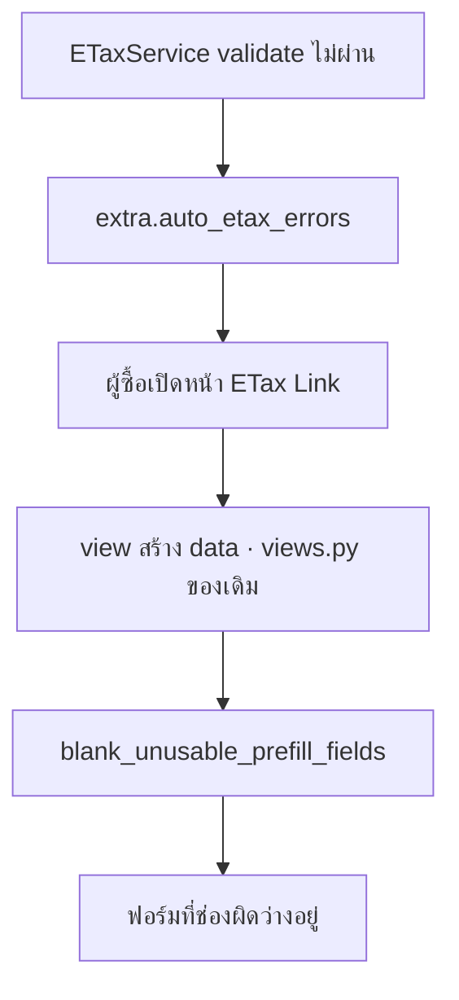

## แนวคิดหลัก

หน้า ETax Link เติมข้อมูลผู้ซื้อจาก `order_json` ให้ล่วงหน้า เพื่อให้ผู้ซื้อกดยืนยันได้เลย โดยไม่ต้องพิมพ์ใหม่ ปัญหาคือ**มันเติมมาให้แม้กระทั่งค่าที่ใช้ไม่ได้** — ผู้ซื้อที่ข้อมูลถูก Lazada ปิดบังจะเห็นชื่อตัวเองเป็น `ก*ี` ที่อยู่เป็น `1*ร, ฉ*o, บ*g, 2*0 24130` แล้ว**กดยืนยันผ่านไปโดยไม่ทันสังเกต** ผลคือได้ใบกำกับภาษีที่ชื่ออ่านไม่ออก ซึ่งใช้ยื่นสรรพากรไม่ได้

เรื่องนี้สำคัญขึ้นมากเมื่อฟีเจอร์แจ้งลิงก์ทำงาน เพราะ**เราจะเป็นฝ่ายส่งลิงก์นี้ไปหาผู้ซื้อเอง** — เท่ากับเชิญคนมาเหยียบกับดักที่เรารู้ว่ามีอยู่

**กฎมีข้อเดียว:** ฟิลด์ไหนอยู่ใน `order_json.extra.auto_etax_errors` → ปล่อยว่าง

ที่ทำให้กฎเรียบง่ายขนาดนี้ได้คือ **ชื่อ key ใน `auto_etax_errors` ตรงกับชื่อฟิลด์ของ `order_json` แบบหนึ่งต่อหนึ่งอยู่แล้ว** จึงไม่ต้องแยกว่าค่าผิดเพราะถูกปิดบัง เพราะเลขสาขาผิดรูป หรือเพราะอีเมลว่าง — ทุกสาเหตุปลายทางเดียวกัน

## ของอยู่ตรงไหน



| ไฟล์ | รับผิดชอบ |
|---|---|
| `etax_link_prefill.py` — `PREFILL_FIELD_BY_ORDER_JSON_FIELD` | แผนที่ 8 คู่ “ชื่อฟิลด์ใน `order_json`” → “ชื่อฟิลด์ในฟอร์ม” (ส่วนใหญ่แค่แปลง snake_case แต่มีคู่ที่ไม่ตรงกันคือ `customerpostcode` → `post_code`) |
| `get_unusable_prefill_fields()` | อ่าน `auto_etax_errors` แล้วคืน set ของชื่อฟิลด์ฝั่งฟอร์ม |
| `blank_unusable_prefill_fields()` | เซ็ตฟิลด์เหล่านั้นเป็น `""` |
| `views/views.py:139` | จุดเรียก — หลังสร้าง `data` ครบแล้ว |

## เดินตามข้อมูลจริงหนึ่งชุด

ออเดอร์ Lazada ที่ชื่อถูกปิดบังและไม่มีอีเมล:

```json title="input — order_json (ตัดมาเฉพาะที่เกี่ยว)"
{
  "customername": "ก*ี",
  "customeremail": "",
  "customerphone": "0812345678",
  "customerpostcode": "10310",
  "extra": {
    "auto_etax_errors": {
      "customername": "ข้อมูลถูกปิดบัง",
      "customeremail": "อีเมลว่าง"
    }
  }
}
```

```json title="output — data ที่ส่งกลับไปให้ฟอร์ม"
{
  "customer_name":  "",           ← ล้าง (อยู่ใน auto_etax_errors)
  "customer_email": "",           ← ล้าง (อยู่ใน auto_etax_errors)
  "customer_phone": "0812345678", ← คงเดิม (ไม่อยู่ในรายการ)
  "post_code":      "10310"       ← คงเดิม
}
```

สังเกตว่า `customer_phone` **ไม่ถูกล้าง** ทั้งที่เบอร์โทรก็เป็นฟิลด์ที่ Lazada ปิดบังได้ — เพราะกฎไม่ได้ดูว่าค่า*หน้าตา*เหมือนถูกปิดบังไหม แต่ดูว่า `validate_ready_for_etax` *บ่น*ถึงมันไหม ในเคสนี้เบอร์นี้ผ่าน validate จึงถือว่าใช้ได้ นี่คือ**การตัดสินใจ ไม่ใช่ช่องโหว่**: ใช้แหล่งความจริงเดียว (ตัว validate) แทนที่จะเขียนตัวตรวจ mask ขึ้นมาใหม่ที่จะไปเถียงกันเองวันหลัง

## การป้องกันการถดถอย

ข้อกังวลใหญ่ของตั๋วนี้ไม่ใช่ “ล้างไม่ครบ” แต่คือ **“ล้างของที่ไม่ควรล้าง”** เพราะหน้าเดียวกันนี้รับผู้ซื้อที่มาจาก**ลิงก์ SMS และ QR code** ด้วย ออเดอร์กลุ่มนั้นไม่มี `auto_etax_errors` เลย และต้องได้ค่าเดิมทุกฟิลด์

ในโค้ดมีการป้องกันสามชั้น — ทุกชั้นคืน *set ว่าง* ซึ่งแปลว่า “ไม่ล้างอะไรเลย”: `extra` ไม่ใช่ dict, `auto_etax_errors` ไม่ใช่ dict, และ key ที่ไม่รู้จักถูกกรองด้วย `if field in PREFILL_FIELD_BY_ORDER_JSON_FIELD` (ข้อหลังสำคัญ เพราะถ้า validate เพิ่ม error key ใหม่ที่ยังไม่มีในแผนที่ ระบบจะ**เมินมัน ไม่ใช่ `KeyError`** — เลือกให้พังฝั่งปลอดภัย)

| เทสต์ | ล็อกอะไร |
|---|---|
| `test_masked_fields_are_blanked` | เส้นทางหลัก |
| `test_other_fields_are_still_prefilled` | ล้างเฉพาะที่ควร ไม่เหวี่ยงแห |
| `test_only_listed_fields_are_blanked` | บางฟิลด์ผิด บางฟิลด์ถูก ในออเดอร์เดียวกัน |
| `test_order_without_auto_etax_errors_is_unchanged` | **ตัวสำคัญที่สุด** — กันการถดถอยของลิงก์ SMS/QR ซึ่งเป็นเส้นทางที่มีผู้ใช้จริงอยู่แล้ว และเป็นสิ่งเดียวที่ตั๋วนี้ทำพังได้จริง ๆ |

ทั้ง 4 ตัวยิงผ่าน endpoint จริงแล้วดูค่าที่ส่งกลับ ไม่มีตัวไหนเรียกฟังก์ชันใน `etax_link_prefill.py` ตรง ๆ

```console
task test:dobybot -- etax.tests.test_etax_link_prefill
Ran 4 tests — OK
```

:::note
**สิ่งที่ตั๋วจงใจไม่ทำ:** ไม่เพิ่มด่านตรวจข้อมูลที่ถูกปิดบังตอนผู้ซื้อกดส่งฟอร์ม เหตุผลคือ DBT-324 จงใจเว้นเส้นทางที่คนกรอกเองไว้ การเพิ่มด่านจะเปลี่ยนพฤติกรรมของ*ทุกคน* ที่กรอกฟอร์มรวมถึง staff การล้าง prefill แก้ที่ต้นเหตุแล้ว — ยืนยันแล้วว่า diff ไม่แตะเส้น submit จริง
:::
