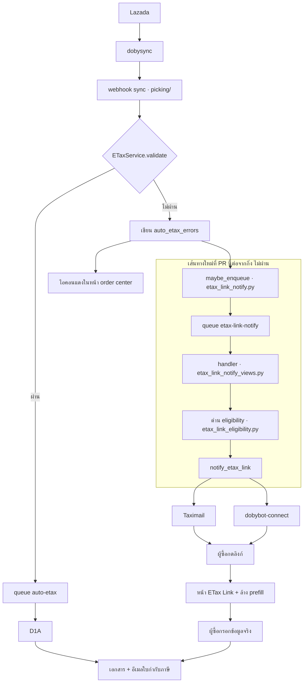

:::tldr
- **ปัญหา:** ผู้ซื้อบน Lazada กดขอใบกำกับภาษี แต่ Lazada ปิดบังข้อมูลเขา (ชื่อกลายเป็น `ก*ี`) ระบบจึงออกเอกสารให้ไม่ได้ แล้ว*เงียบ* — ไม่มีใครบอกผู้ซื้อว่าต้องทำอะไรต่อ สัดส่วนออเดอร์แบบนี้โตจาก 0% เป็น 10.3% ในสองเดือน
- **สิ่งที่ PR นี้ทำ:** เมื่อออกเอกสารอัตโนมัติไม่ได้ ระบบจะ**ส่งลิงก์ให้ผู้ซื้อกรอกข้อมูลเอง** ทางอีเมลและ/หรือแชทของ marketplace ตามที่ร้านตั้งค่า
- **เกือบทั้งหมดเป็นการต่อสายของเดิม** — หน้าให้กรอก, ตัวส่งอีเมล, ตัวส่งแชท Lazada/Shopee, ตัวย่อลิงก์ และจุดที่รู้ว่า “ออกไม่ได้” มีอยู่ในระบบครบแล้ว ของใหม่จริง ๆ คือกาว + สวิตช์ + log
- **ปิดเป็นค่าเริ่มต้น** ร้านที่ไม่ได้ตั้งอะไรเลยจะไม่มีข้อความออกไปแม้แต่ฉบับเดียว และมีเบรกสองชั้น (ปิดรายร้าน / pause queue ทั้งระบบ)
- **สิ่งที่เสี่ยงที่สุด** ไม่ใช่โค้ดส่งข้อความ แต่คือ **7 บรรทัดใน `picking/models/models.py`** ที่แทรกเข้า hot path ของ sync — เส้นที่ *ทุกออเดอร์ของทุกบริษัท* วิ่งผ่านทุกรอบ และ**สเปกไม่ได้ขอ**
:::

## 1 · ฟีเจอร์นี้ทำให้ทำอะไรได้ที่เมื่อวานทำไม่ได้

ก่อนหน้านี้ เมื่อผู้ซื้อกดขอใบกำกับภาษีผ่าน marketplace แล้วระบบออกให้ไม่ได้ ปลายทางมีอยู่ทางเดียว: ระบบเขียนสาเหตุลงในข้อมูลออเดอร์ ขึ้น**ไอคอนแดง**ในหน้า order center แล้วจบ ใครสักคนที่ร้านต้องนั่งไล่ดูไอคอนแดง แล้วกดส่งลิงก์ทาง SMS ให้ทีละใบด้วยมือ **ในทางปฏิบัติแทบไม่มีใครทำ**

หลัง PR นี้ ระบบ**ตามผู้ซื้อให้เอง** — ส่งลิงก์ไปหาเขาโดยตรง ผู้ซื้อกดลิงก์ กรอกข้อมูลจริง แล้วเอกสารออกตามเส้นทางเดิมที่มีอยู่แล้ว โดยไม่มีใครที่ร้านต้องแตะอะไร

ประเด็นที่ทำให้เร่งด่วน: Lazada เปลี่ยน policy มาปิดบังข้อมูลผู้ซื้อ — ชื่อ ที่อยู่ เบอร์โทร ถูกตัดเหลือ *อักษรแรก + `*` + อักษรท้าย* สัดส่วนออเดอร์ที่โดนขึ้นจาก **0% (พ.ค.) → 5.8% (20 ก.ค.) → 10.3% (27 ก.ค.)** การปิดบังกำลังกลายเป็นเส้นทางหลัก ไม่ใช่เคสขอบอีกต่อไป

## 2 · ภาพรวมระบบ — ของใหม่อยู่ตรงไหน



## 3 · ตามหนึ่งออเดอร์จริง ตั้งแต่ต้นจนจบ

สมมติออเดอร์ Lazada เลข `1234567890` ของร้าน `company_id=42` ผู้ซื้อกดขอใบกำกับภาษีบน Lazada และร้านเปิด auto-create ไว้ Lazada ส่งชื่อผู้ซื้อมาเป็น `ก*ี` และ `customeremail` ว่าง

| # | เกิดอะไร | ไฟล์ที่รับไม้ |
|---|---|---|
| 1 | dobysync ยิง webhook เข้ามา ระบบอัปเดต `order_json` ของออเดอร์ — และ**ยกเครื่องหมาย “เคยส่งแล้ว” ข้ามมาให้ payload ใหม่** ไม่ให้หายไป | `picking/models/models.py` → `_carry_over_extra_keys` |
| 2 | `validate_ready_for_etax` ไม่ผ่าน (ชื่อถูกปิดบัง + ไม่มีอีเมล) ระบบเขียน `order_json.extra.auto_etax_errors = {"customername": …, "customeremail": …}` | `services/etax_invoice/etax_service.py:213` |
| 3 | ตรงกิ่งนั้นเอง เรียก `maybe_enqueue_etax_link_notify(po)` ซึ่งตรวจ **แค่ 3 อย่างที่ถูก** (มาจาก marketplace? ร้านเปิดสวิตช์? ยังไม่เคยส่ง?) แล้วแขวน Cloud Task — *ไม่เรียก API ภายนอกใน request ของ webhook* | `etax/utils/etax_link_notify.py:106` |
| 4 | Cloud Tasks queue `etax-link-notify` รับงานไว้ (`maxAttempts=1` · task id คงที่ต่อ (บริษัท, เลขออเดอร์) กันงานซ้ำตอน sync รัว ๆ) | `cloudtasks/tasks.py:566` |
| 5 | queue ยิงกลับเข้า `POST /api/etax/link-notify/tasks/handler/` handler หาออเดอร์ → หาออเดอร์หลัก → ส่งต่อ | `etax/views/etax_link_notify_views.py` |
| 6 | **ถามด่านเดียวกับที่หน้า ETax Link ใช้** ว่าลิงก์นี้กดแล้วใช้ได้จริงไหม (ถูกยกเลิก? เกินจำนวนวัน? ยังไม่รับของ? เลยวันตัดรอบ?) — ไม่ผ่าน = ไม่ส่ง แล้วรอบ sync ถัดไปค่อยว่ากัน | `etax/utils/etax_link_eligibility.py` |
| 7 | อ่าน `ETAX_LINK_NOTIFY_CHANNEL` แล้วส่งตามช่องนั้น — ที่นี่ไม่มีอีเมลผู้ซื้อ จึง**เขียน log ว่า `NO BUYER EMAIL`** และ **ไม่ปั๊มเครื่องหมาย** เพื่อให้รอบ sync ถัดไปลองใหม่ (อีเมลมักถูกเติมเข้ามาทีหลัง) | `notify_etax_link` / `send_etax_link_email` |
| 8 | สอง sync ถัดมา Lazada ส่งอีเมลผู้ซื้อมาแล้ว → ส่งอีเมลสำเร็จ → เขียน log `EMAIL SENT` → **ปั๊ม `etax_link_notified_at`** → ไม่มีการทวงอีก | เดิม |
| 9 | ผู้ซื้อกดลิงก์ เปิดหน้า ETax Link — ช่อง “ชื่อ” และ “อีเมล” **ว่าง** (ไม่ใช่ `ก*ี`) เพราะสองฟิลด์นั้นอยู่ใน `auto_etax_errors` | `etax/utils/etax_link_prefill.py` |
| 10 | ผู้ซื้อกรอกข้อมูลจริง กดยืนยัน → เอกสารออกตามเส้นทางเดิม ไม่มีโค้ดใหม่ในขั้นนี้ | เดิมทั้งหมด |

## 4 · จะลองใช้จริงยังไง

**ก่อน deploy — งาน infra ที่ต้องเสร็จก่อน** (ทำแล้ว):

```console
gcloud tasks queues describe etax-link-notify --project=dobybot --location=asia-southeast1
name: projects/dobybot/locations/asia-southeast1/queues/etax-link-notify
rateLimits: {maxDispatchesPerSecond: 10.0, maxConcurrentDispatches: 10}
retryConfig: {maxAttempts: 1}
state: RUNNING
```

**เปิดให้ร้านหนึ่งร้าน** — ทั้ง 3 คีย์เป็น staff-only จึงตั้งได้ที่ Django admin เท่านั้น (ลูกค้าแก้เองไม่ได้ เพราะ Lazada มี policy บล็อกข้อความเชิงโฆษณา ร้านที่แก้ข้อความเองอาจทำให้ shop ถูกลงโทษ):

1. เข้า Django admin → Company settings ของร้านนั้น → กลุ่ม **ETAX** → หัวข้อ **ETax Link Notify**
2. เปิด `ETAX_LINK_NOTIFY_ENABLE` (ค่าเริ่มต้น = ปิด)
3. เลือก `ETAX_LINK_NOTIFY_CHANNEL` จาก dropdown: `email` / `chat` / `both`
4. ตรวจข้อความใน `ETAX_LINK_NOTIFY_CHAT_MESSAGE` (ค่าเริ่มต้นมีลิงก์อยู่แล้ว)

:::note
เลือกร้านนำร่องที่**ต่อแชท Lazada ไว้แล้ว** จะได้ทดสอบทั้งสองช่องทางพร้อมกัน — จาก 24 ร้านที่เปิด auto-create มีเพียง 8 ร้านที่ต่อแชทไว้
:::

**ดูผล** — ทุกความพยายามส่งเขียนหนึ่งแถวลงบันทึกข้อความ กรองด้วย:

```sql title="SQL — ตรวจผลหลังเปิดฟีเจอร์"
SELECT channel, status->>'name' AS status_name, status->>'reason' AS reason, COUNT(*)
FROM logger_smslog
WHERE remark = 'ETAX-LINK-NOTIFY' AND company_id = 42
GROUP BY 1, 2, 3 ORDER BY 4 DESC;
```

**รันเทสต์ในเครื่อง** (container stack แยกต่อ worktree ไม่แตะ prod/uat):

```console
task test:dobybot -- etax.tests.test_etax_link_notify_chat
Ran 18 tests — OK
```

**เบรกสองชั้นถ้าพัง**

1. ปิด `ETAX_LINK_NOTIFY_ENABLE` รายร้าน — หยุดงานใหม่ แต่งานที่ค้างในคิวยังวิ่ง
2. `gcloud tasks queues pause etax-link-notify` — kill switch ระดับระบบ ทำได้ตอนตีสามโดยไม่ต้อง deploy และ**งานที่ค้างไม่หายไป** resume แล้ววิ่งต่อ

## 5 · ขอบเขต ความเสี่ยง และสิ่งที่จงใจไม่ทำ (ระดับ product)

| เรื่อง | ตัดสินใจว่า | เพราะ |
|---|---|---|
| ทวงซ้ำ | **ไม่ทำ** ส่งครั้งเดียวต่อออเดอร์ | ผู้ซื้อไม่ควรถูกตามหลายรอบเรื่องเดียว |
| ออเดอร์ POS / B2B / ค้าส่ง | **ไม่ส่ง** | ลูกค้า B2B ได้ข้อมูลภาษีจากสัญญา ลูกค้า POS ยืนอยู่หน้าร้าน |
| SMS เป็นช่องทางอัตโนมัติ | **ไม่ทำ** | เบอร์โทรเป็นหนึ่งในฟิลด์ที่ Lazada ปิดบัง จึงส่งไม่ถึงอยู่ดี |
| ผูกกับเรื่อง “ข้อมูลถูกปิดบัง” | **ไม่ผูก** ใช้เงื่อนไข “validate ไม่ผ่าน” ล้วน ๆ | marketplace อื่นที่เริ่มปิดบังบ้างจะทำงานทันทีโดยไม่ต้องแก้โค้ด |
| fallback ข้ามช่องทาง | **ไม่ทำ** ตั้งแชทแล้วส่งไม่ได้ = ไม่ไปส่งอีเมลแทน | ข้อความแชทเป็นของที่ staff คุมด้วยเหตุผล policy · ร้านที่อยากได้ทั้งสองตั้ง `both` |
| backfill `channel` ของแถวอีเมลเก่า | **ไม่ทำ** | ตาราง 41.9 ล้านแถว / 26 GB และ `sender` ไม่มี index — UPDATE = full scan + WAL มหาศาลตอน deploy |

**ความเสี่ยงที่เหลืออยู่ ระดับ product**

1. **โดเมน `etax.me` ยังไม่เคยผ่านแชท Lazada** — หลักฐานที่มี (1,758 ข้อความ ส่งถึง 92%) พิสูจน์แค่โดเมนของระบบวิดีโอ ไม่ได้พิสูจน์ทุกโดเมน · *มีทางถอย:* ตัดตัวแปรลิงก์ออกจากข้อความ แล้วมันจะกลายเป็นข้อความ “ไปดูอีเมล” เอง ไม่ต้อง deploy
2. **อีเมลอาจเข้า spam** เพราะส่งแบบไม่ใช้ template ของ Taximail หน้าตาจึงเรียบกว่าอีเมลใบกำกับภาษีเดิม — เป็นความล้มเหลว*แบบมองไม่เห็น* เพราะ log จะบอกว่า “ส่งแล้ว” · *ทางถอย:* จุดเรียกมีจุดเดียว เปลี่ยนไปใช้ template ได้
3. **access token แชท Lazada หมดอายุ** เป็นสาเหตุของการส่งไม่สำเร็จเกือบทั้งหมดในปัจจุบัน (91 จาก 142 ใบ) — เป็น**เพดาน**ของช่องทางแชทที่ PR นี้ไม่ได้แก้และไม่ได้ตั้งใจจะแก้
4. **หน้าต่างเวลาแคบสำหรับ 6 ร้าน** ที่ตั้ง “ขอได้เมื่อรับของแล้ว” — ออเดอร์ Lazada ยืนยันรับของราววันที่ 5–9 แต่ทั้ง 6 ร้านตั้งวันเปิดไว้ 10 วัน ผู้ซื้อบางคนเหลือเวลา**วันเดียว** และราว 15% ไม่เคยยืนยันรับของเลย จึง**ไม่มีวันได้รับแจ้ง** — เป็นการตัดสินใจเชิงธุรกิจของร้าน ไม่ใช่โค้ด

## 6 · เทียบเจตนากับของที่ได้จริง

อ่านสเปก [#218](https://github.com/dobybot/dobybot-monorepo/issues/218) ทีละข้อ (30 user stories + 29 implementation decisions + 8 ตั๋วลูก) แล้วไล่หาในโค้ด — ไม่ใช่ดูจาก diff อย่างเดียว เพราะ *สิ่งที่ขาดไม่มีบรรทัดสีแดงให้เห็น*

::reconciliation

:::note
**ที่ตรวจแล้วว่า*ไม่ใช่*ของเกิน** — สองอย่างที่ดูเหมือนเป็นของที่คิดขึ้นเองตอน implement แต่พิสูจน์แล้วว่าเป็นแบบแผนที่มีอยู่ก่อน: sentinel `DO_NOT_SEND_EMAIL` (ใช้อยู่แล้วใน `d1a_schema.py`, `taximail.py`, `express_etax.py`) และการเลือก 6 เหตุผลใน eligibility helper (มากกว่า “3 ด่าน” ที่ #219 ระบุ — แต่จำเป็น เพราะ AC บังคับว่า view ต้องไม่เหลือตรรกะเงื่อนไขไว้เอง จึงต้องย้ายมาทั้งหมด)
:::

## 7 · ความเสี่ยงที่*สเปกไม่เคยพูดถึงเลย*

สองข้อนี้ไม่อยู่ในทั้ง #218 และตั๋วลูกใบไหน แต่โผล่ขึ้นมาจากการอ่านโค้ดจริงเทียบกับระบบรอบข้าง:

1. **ฟีเจอร์นี้กินโควตาแชทรายวันของ shop ร่วมกับข้อความ “พร้อมส่ง”** — `send_lazada_chat` ตรวจ `LAZADA_CHAT_DAILY_LIMIT` ก่อนส่ง (`messaging.py:843`) ถ้าโควตาเต็ม ข้อความจะกลายเป็น `DAILY_LIMIT_REACHED` แปลว่าฟีเจอร์นี้กับข้อความแจ้งพร้อมส่ง (ซึ่งผูกกับรายได้โดยตรง) **แย่งโควตากันเอง** โดยไม่มีใครตั้งใจให้เป็นแบบนั้น ยังไม่มีใครประเมินว่าร้านนำร่องเหลือโควตาเท่าไร
2. **การ enqueue ไม่มีเพดาน** — ฝั่ง enqueue ตรวจแค่ marker เท่านั้น ออเดอร์ที่ส่งไม่สำเร็จตลอด (ไม่มีอีเมล + ร้านไม่ได้ต่อแชท) จะ**สร้าง Cloud Task ใหม่ทุกรอบ sync** พร้อมเขียน log เพิ่มหนึ่งแถวทุกครั้ง จนกว่าจะพ้นด่านจำนวนวันไป สเปก D6 ยอมรับ “รอบ sync ถัดไปคือ retry” แต่*ไม่เคยประเมินว่าเป็นกี่รอบ*

::divider[จากตรงนี้ = มุมมองวิศวกร สำหรับคนที่จะ verify / ดูแลต่อ]

## 8 · แผนที่กล่อง — จะอ่านโค้ดส่วนไหนลึกแค่ไหน

แบ่งตาม **dataflow ไม่ใช่ตามไฟล์** · การจัดกล่องนี้เป็นข้อเสนอ **บอกในแชทได้ว่าอยากให้ส่วนไหนเปลี่ยนระดับ** แล้วผมจะเขียนหน้านั้นใหม่ตามระดับที่ขอ

::box-map
